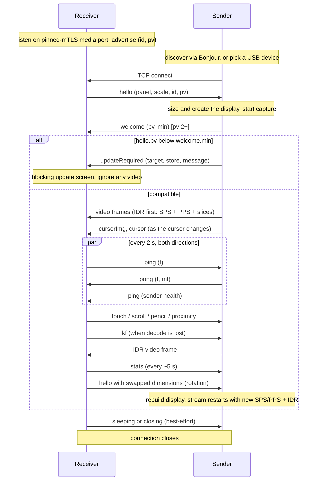

# OpenDisplay Wire Protocol

**Protocol version (`pv`): 21** &nbsp;|&nbsp; Status: **normative** for `pv <= 21`

This document specifies the wire protocol spoken between an OpenDisplay
*sender* (the machine whose desktop is extended, the Mac app today) and an
OpenDisplay *receiver* (the device that shows the extra display, the
iPhone/iPad app today). It describes everything that crosses the socket and
nothing that happens on either side of it: display creation, capture,
encoding, decoding, rendering, and input injection are implementation
details of each end and are out of scope (see [Appendix B](#appendix-b-implementers-notes-non-normative)
for non-normative hints).

Two companion documents:

* [COMPATIBILITY.md](COMPATIBILITY.md) is the policy for *evolving* this
  protocol: version negotiation rationale, the additive-by-default rule, and
  the two-phase procedure for breaking changes. This document describes the
  wire as it is; that one describes how it changes.
* [README.md](README.md) gives the product-level overview.

### Naming

The protocol is named the **OpenDisplay protocol** after the product. For
historical reasons the Bonjour service type is `_opensidecar._tcp` (the
project's original name) and it stays that way: renaming it would break
every deployed peer for zero functional gain. Do not read anything into the
mismatch.

### No support commitment

This specification exists so that independent implementations can
interoperate with the official apps and with each other. Publishing it is
**not** a commitment to ship official apps for other platforms, to keep
the protocol frozen, or to support third-party implementations. Issues
caused by third-party clients should be reported to those projects.

### Conventions

The key words MUST, MUST NOT, SHOULD, SHOULD NOT, and MAY are to be
interpreted as described in [RFC 2119](https://www.rfc-editor.org/rfc/rfc2119).
Every requirement applies to `pv` 12 unless a different version is called
out. "The official apps" means the Mac sender and iOS receiver in this
repository; their behavior is cited as illustration, not as requirement,
unless marked normative.

---

## 1. Roles and transport

* The **receiver listens** on the pinned mutual-TLS 1.3 media port
  (`WireCrypto.tlsPort`) and advertises itself. **Production media, control
  and input sessions never run over plaintext**: LAN, Remote and USB all
  converge on that one pinned-mTLS listener. The former plaintext TCP 9000
  media listener (and the UDP cursor listener that hung off it) is removed;
  older plaintext-only senders simply fail to connect (no downgrade).
  Pairing (port 9002) is a separate bootstrap protocol.
* The **sender connects** to the receiver.

This role assignment is the most load-bearing decision in the protocol and
MUST be preserved: because the receiver is always the listening end, the
sender reaches it identically over WiFi (dial the discovered address) and
over USB (dial a tunneled port), and one code path serves both transports.

* The protocol runs over a **single pinned mutual-TLS 1.3 connection**.
  Video, control messages, cursor and telemetry all share it, in both
  directions. (The historical UDP cursor side channel, section 6.3, is
  removed.)
* The framing described below is the *inner* application stream; the
  historical `pv` 3 text describing "no TLS, no authentication" no longer
  applies to production. Implementations SHOULD
  disable Nagle's algorithm (TCP_NODELAY); input events are tiny packets and
  coalescing them reads as input lag.
* A receiver serves **one sender at a time**. When a new inbound connection
  arrives while one is active, the receiver MUST adopt the new connection
  and drop the old one (the official receiver cancels the old connection
  and resets its decoder state).

## 2. Transport bindings

The core protocol is transport-agnostic beyond "a pinned mutual-TLS byte stream to the
receiver's media port". How the sender finds that port is a *binding*. Two
bindings exist today; ports to other platforms MAY define their own (for
example an Android receiver reachable over `adb reverse`) without touching
anything else in this document.

### 2.1 WiFi / LAN (Bonjour)

The receiver advertises a Bonjour (mDNS/DNS-SD) service:

* **Type:** `_opensidecar._tcp`
* **Name:** a human-readable, user-editable device name (defaults to the
  device's name). The name is display-only. It MUST NOT be used as a device
  identity: users rename devices, and two devices can share a name.
* **TXT record keys:**

| Key | Value | Since | Meaning |
|---|---|---|---|
| `id` | UUID string | pv 1 era | Stable per-install identity. MUST equal the `id` later sent in `hello`. Lets a sender recognize "same device, different transport/name". |
| `pv` | decimal integer as string, e.g. `"3"` | pv 2 | The receiver's protocol version. Absent means `pv` 1. Lets a sender evaluate compatibility before dialing. |

Senders MUST tolerate an absent TXT record and absent keys (pre-`pv` 2
receivers advertise neither).

At pv 11 this service resolves to TCP port 9001 and carries TLS 1.3. Both
peers present persistent self-signed P-256 certificates and verify the leaf
SubjectPublicKeyInfo against their stored peer pin. A failed handshake,
missing pin, or changed key is terminal and MUST NOT retry as plaintext.

An unpaired pv 11 receiver also advertises `_opendisplay-pair._tcp` on TCP
port 9002. It conveys discovery, not trust, and carries no secret.
The Mac sender advertises `_opendisplay-mac-pair._tcp` while running so the
receiver can present the product's primary "nearby Mac → Pair" flow. Both
pairing advertisements carry only `id` and `pv` discovery metadata.

### 2.2 USB (Apple devices)

For iPhones/iPads on a cable, the sender dials through **usbmuxd**, the
device-multiplexing daemon that ships with macOS and is available on Linux
and Windows via [libimobiledevice](https://libimobiledevice.org). The
sender asks usbmuxd to `Connect` to the receiver's mTLS media port on the chosen device
(through a one-shot loopback bridge that only splices ciphertext);
after the `OK` result the usbmuxd socket becomes a transparent byte pipe
and the protocol proceeds exactly as over WiFi.

Bonjour plays no role on this path. The official receiver classifies a
connection arriving from loopback as "USB" purely for its stats display;
this has no protocol significance.

USB is only a route: the same pinned mutual TLS runs inside the usbmux pipe,
and there is no plaintext USB path. Port 9002 can be
reached through the same tunnel to create exactly the same peer pins without
manual SAS comparison. There is no separate USB trust record.

### 2.3 First pairing (pv 11)

Each side generates a fresh P-256 ECDH key and 32-byte nonce. Pairing hello
messages contain the protocol version, stable device ID, display name,
persistent TLS identity SPKI, ephemeral public key, and nonce. The canonical
transcript is role-ordered and length-prefixes every field.

Both sides compute P-256 ECDH and HKDF-SHA256 with the transcript hash as
salt and a protocol-specific domain. A separately domain-separated value is
reduced to a six-digit SAS, displayed as `123 456`. The SAS authenticates the
exchange; it is never a password or encryption key. After the users confirm
the match on both devices, each sends an HMAC-SHA256 confirmation under a
role-specific HKDF key. The peer pin is saved only after local acceptance and
a valid accepted peer confirmation.

Changing any identity, ephemeral key, nonce, role, name, ID, or version
changes the transcript and SAS. Existing peer IDs with different SPKIs are
never overwritten; recovery requires Forget Device. Messages use the normal
big-endian length framing, are limited to 64 KiB, and are invalid on the
media listener.

## 3. Framing

Every message in **both directions** is length-prefixed:

```
[4-byte payload length, unsigned, big-endian][payload]
```

* The length counts the payload only, not the 4 header bytes.
* A frame is either a **video frame** (section 5) or a **control message**
  (section 6), distinguished as described in section 4.
* **Receiver to sender**, the payload MUST be `1` to `2^20 - 1` bytes. The
  official sender treats a length of 0 or `>= 2^20` as a protocol error and
  stops reading control messages on that connection.
* **Sender to receiver**, no hard maximum is enforced, but control messages
  are constrained by the demux rule below and video frames SHOULD stay in
  the low megabytes (a keyframe of a large panel).
* TCP gives no message boundaries: receivers of either role MUST buffer and
  reassemble; a frame MAY arrive split across many socket reads or packed
  together with others in one read.

## 4. Channel demux (deprecated heuristic)

All receiver-to-sender frames are JSON control messages, so the sender
needs no demux.

Sender-to-receiver frames carry both H.264 video and JSON control messages
on the same connection. At `pv <= 3` the receiver distinguishes them
**heuristically**. A frame is a JSON control message if and only if all
three hold:

1. payload length `< 32768` bytes, and
2. the first byte is `{` (0x7B), and
3. the payload contains no NUL byte (0x00).

Anything else is a video frame. This works because Annex B start codes
(`00 00 00 01`) guarantee NUL bytes in every video frame, including video
frames that *begin* with `{` (the telemetry prefix, section 5.1).

Consequences that are **normative for senders**:

* A sender MUST NOT emit a control message that is 32768 bytes or longer,
  starts with anything but `{`, or contains a NUL byte. The largest
  official control message, the base64 cursor sprite (`cursorImg`), caps
  its PNG at 24000 bytes precisely to stay under this limit after base64
  expansion.
* A sender MUST NOT emit a video frame that satisfies the JSON test (this
  cannot happen with well-formed Annex B payloads).

**Deprecation.** This heuristic is a design debt, not a feature. It is
specified here so that `pv <= 4` implementations agree on it, and it is
**expected to be replaced by a typed frame header in a future `pv`** (a
discriminator between the length prefix and the payload). The change will
follow the two-phase procedure in COMPATIBILITY.md section 6: a release
that understands both framings, then, after adoption, a release that
requires the new one. Implementers SHOULD isolate the demux decision in
their code so the swap is cheap, and MUST NOT build features that depend on
the heuristic's edge cases (for example, deliberately sending binary
control data to route it to the video path).

## 5. Video

The video stream is **H.264 Annex B**, one *access unit* (one encoded
picture) per wire frame.

### 5.1 Frame layout

```
[optional telemetry prefix: JSON, no start codes]
[00 00 00 01][NALU] [00 00 00 01][NALU] ...
```

* **Telemetry prefix.** Everything before the first start code, if
  anything, is a JSON object stamped by the sender:
  `{"cap":<ms>,"snd":<ms>}` where `cap` is the capture timestamp and `snd`
  the send timestamp, both milliseconds since the Unix epoch on the
  sender's clock. Receivers MUST tolerate its absence and MUST ignore
  unknown fields; it exists only for latency measurement (combined with the
  clock offset from section 8.1). Senders SHOULD include it.
* **Start codes are always 4 bytes** (`00 00 00 01`). Senders MUST NOT emit
  3-byte start codes; receivers MAY therefore split on the 4-byte pattern
  only. (A receiver that also handles 3-byte codes works today by accident;
  do not rely on it in either direction.)
* **Keyframes carry their parameter sets.** Every IDR frame MUST be
  prefixed with the current SPS and PPS NALUs. Non-keyframes carry only
  slice data (plus optional SEI, which receivers MAY skip).
* All slices of one picture MUST travel in one wire frame; receivers SHOULD
  decode each wire frame as one sample.
* **No presentation timestamps** cross the wire. The stream is low-latency
  (no B-frames in the official sender); receivers display frames in arrival
  order, as fast as they arrive.

### 5.2 Stream changes

The encoded video size is chosen by the sender and MAY differ from the
panel size announced in `hello` (the official sender offers reduced-scale
quality presets). Receivers MUST take the video dimensions from the SPS,
never from `hello`.

When the stream changes size (device rotation, quality change), the sender
simply starts sending frames with new SPS/PPS. Receivers MUST detect the
parameter-set change, rebuild their decoder, and discard buffered frames
from the old format.

### 5.3 Keyframe recovery

A receiver that cannot decode (it joined mid-GOP, lost its decoder, or
resumed from background) requests a keyframe with the `kf` control message
(section 6.1). The sender MUST respond by making the next transmitted frame
an IDR (with SPS/PPS, per 5.1). Senders SHOULD also send an IDR unprompted
whenever a connection is (re)established, including replaying the last
captured frame if the screen is static and the capturer produces nothing.

## 5A. Mac system audio (`pv` 12)

A copy of the sender's system audio — never a reroute of its physical
output, and never a third-party virtual audio device — carried as AAC-LC
alongside the video stream. There is no legacy fallback (like `keyboard`,
unlike `pencil`/`pointer`): a receiver MUST NOT send `audioRequest`, and a
sender MUST NOT emit audio media frames, when the peer's `pv` is below 12.
Audio is opt-in per receiver via `audioRequest`/`audioState` (section 6);
it is never sent unrequested.

### 5A.1 Framing: the typed marker byte

Section 4's channel demux is a documented heuristic, not a foundation to
extend: it works only because Annex B start codes guarantee a NUL byte and
control messages are JSON. Audio frames instead start with a **reserved
one-byte marker**, `0x01`, that both the JSON-control shape (starts with
`{`, 0x7B) and the legacy video shape (also starts with `{`, the telemetry
prefix) can never produce:

```
[0x01][subtype: 1 byte][subtype-specific body]
```

A receiver checks this byte **before** running the section 4 demux at all.
Because audio frames are gated on `pv` 12, a peer below that version never
receives one, so introducing this discriminator needs no two-phase
migration — it only ever appears on a wire both ends have already agreed
can carry it. Senders MUST NOT emit an audio media frame to a peer whose
`pv` is below 12.

Two subtypes exist:

**`0x01` — config.** Sent once when audio starts (and again if the format
changes) so the receiver can build a decoder before any packet arrives:

```
[sampleRate: uint32 BE][channelCount: uint8][cookieLength: uint16 BE][cookie: cookieLength bytes]
```

`cookie` is the AAC AudioSpecificConfig (the MPEG-4 "magic cookie") a
receiver needs to construct a `CMAudioFormatDescription` (or equivalent).

**`0x02` — packet.** One encoded AAC-LC access unit:

```
[sequence: uint32 BE][capturedAtMs: int64 BE][durationMs: uint32 BE][payloadLength: uint32 BE][payload: payloadLength bytes]
```

* `sequence` starts at 1 and increments by one per packet sent this
  capture generation; informational (packet loss/reorder detection), not
  required for playback since TCP does not lose or reorder bytes.
* `capturedAtMs` is milliseconds since the Unix epoch **on the sender's
  clock**, taken from the audio sample's own capture presentation
  timestamp — the same coordinate space as the video telemetry prefix's
  `cap` field (section 5.1), so a receiver reuses the same ping/pong clock
  offset (section 8.1) to schedule audio relative to when the video for the
  same instant is appearing. Senders MUST NOT derive this from send/arrival
  time.
* `payload` is a raw AAC-LC access unit with **no ADTS header** — the
  format description already carries what an ADTS header would repeat.

A malformed or truncated audio frame (wrong marker, unknown subtype, or a
declared length that does not fit the available bytes) MUST be ignored,
never treated as fatal — the same tolerance section 6 requires for control
messages.

### 5A.2 Codec

AAC-LC, 48 kHz, stereo, ~128 kbps. Senders MUST NOT substitute another
codec; a receiver that cannot decode AAC-LC has no fallback and simply
does not offer Audio.

### 5A.3 No literal negative latency

Audio cannot play before it has arrived. A receiver-local "play audio
earlier" offset is therefore implemented by holding *video* back instead
(non-normative — purely receiver-local presentation timing, described for
implementers in Appendix B). Nothing about this crosses the wire: the sync
offset is never sent to the sender.

## 6. Control messages

Control messages are JSON objects encoded as UTF-8, each in its own frame
(section 3), each with a **`type`** field holding a string discriminator.
All other fields are type-specific.

Two rules make the protocol evolvable, and both are **normative**:

* **Unknown `type` values MUST be ignored** (logging is fine, but at most
  once per type, not per message: input types arrive at hundreds of
  messages per second). A newer peer may send types this implementation
  predates; that is normal, not an error.
* **Unknown fields on a known type MUST be ignored**, and optional fields
  MUST be tolerated when absent. New fields are added without a version
  bump.

An unparseable control payload (not JSON, or no `type`) MUST be ignored,
not treated as fatal.

Numbers are JSON numbers; nothing distinguishes int from float on the wire.
Coordinates use the conventions of section 7.

### 6.1 Receiver to sender

| `type` | Since | Fields | Purpose |
|---|---|---|---|
| `hello` | pv 1 | `pixelsWide`, `pixelsHigh`, `scale`, `device`?, `id`?, `pv`?, receiver UI fields? | Identify the panel; (re)sent on connect, rotation, or receiver UI preference change |
| `ping` | pv 1 | `t` | Liveness + clock sync probe |
| `touch` | pv 1 | `phase`, `x`, `y`, `t`? | Finger input |
| `scroll` | pv 1 | `dx`, `dy` | Two-finger scroll |
| `gesture` | pv 1 | `name` | Semantic receiver gesture |
| `pencil` | pv 3 | `phase`, `x`, `y`, `pressure`, `azimuth`, `altitude`, `rotation`, `t`? | Stylus input |
| `proximity` | pv 3 | `entering`, `x`, `y` | Stylus hover enter/leave |
| `keyboard` | pv 4 | `action`, plus fields per `action` (below) | Keyboard input |
| `pointer` | pv 5 | `action`, plus fields per `action` (below) | Pointer/click gestures |
| `displayModeRequest` | pv 7 | `mode` (`mirror` or `extend`) | Request a Mac-authoritative mode transition |
| `allowInputRequest` | pv 8 | `allowed` (bool) | Request the Mac-authoritative input gate state |
| `videoRequest` | pv 9 | `enabled` (bool) | Request Mac video capture/encode/transmission on or off |
| `nativeAppGesture` | pv 10 | `kind` (`magnify` or `rotate`), `phase` (`began`, `changed`, `ended`, or `cancelled`), `delta` (number) | Continuous foreground-app gesture lifecycle |
| `audioRequest` | pv 12 | `enabled` (bool) | Request Mac system-audio capture on/off for this receiver |
| `mirrorDisplayRequest` | pv 13 | `selectedUUID`? | Select Auto (absent/null) or a specific stable display UUID as the Mirror capture source |
| `extendShapeRequest` | pv 14 | `shape`, `useFullDisplay` (bool) | Request an Extend virtual-display shape change (section 6.7) |
| `maxFPSRequest` | pv 15 | `enabled` (bool), `maxFPS` (int) | Request this peer's receiver-enforced max-FPS enforcement (section 6.8) |
| `smartTouchProbe` | pv 20 | `id` (int), `x`, `y` | Smart Touch (Experimental): ask whether the element at a normalized point is scrollable |
| `sessionInviteResponse` | pv 21 | `id`, `result` | Answer a `sessionInvite` (section 6.9) |
| `kf` | pv 1 | none | Request an IDR (section 5.3) |
| `stats` | pv 1 | free-form | Receiver-side telemetry for the sender's log |
| `sleeping` | pv 2 | none | Device locked; session ends, reconnect on wake expected |
| `closing` | pv 2 | none | App quit; session ends for good |

**`hello`** MUST be the first message a receiver sends on every new
connection, because the sender sizes its virtual display from it and can do
nothing before it arrives.

`nativeAppGesture.delta` is incremental: magnification is the fractional
change since the preceding sample and rotation is radians since the preceding
sample. Magnify and rotate lifecycles MAY overlap. A sender MUST ignore a
`changed`/terminal phase without an active matching `began`.

* `pixelsWide`, `pixelsHigh` (int): the panel size in **physical pixels**,
  in the panel's **current orientation** (portrait swaps them).
* `scale` (number): the device's UI scale factor (2 or 3 on Apple
  hardware). The sender uses it to pick a sensible point-size for the
  virtual display.
* `device` (string, optional): device kind for UI text, `"iPhone"` or
  `"iPad"` from the official receiver. Free-form.
* `id` (string, optional): stable per-install UUID. MUST match the Bonjour
  TXT `id`. Senders use it to recognize the same physical device across
  transports and renames.
* `pv` (int, optional): the receiver's protocol version. **Absent means
  1** (every pre-handshake install).
* `cursorPort` (int, optional, **removed**): formerly advertised the UDP
  cursor side channel. Current receivers never send it; current senders
  ignore it. Cursor positions always travel over the main transport.
* `requestedMode` (string, optional, pv 21): `mirror` or `extend`, the mode
  the receiver asked for with its own pending Connect (section 6.9).
* `addrs` (array of strings, optional): every IP address the receiver is
  reachable on (section 6.4). Link-local IPv6 entries carry no zone id.
  The receiver SHOULD re-send `hello` when this set changes (a cable
  plugged mid-session creates the interface the sender must probe).
  Additive at `pv` 3, no bump.
* `maxEncodeWide` / `maxEncodeHigh` (int, optional): the receiver's decode
  ceiling in pixels (section 6.5) — the largest stream it can sustain,
  independent of the panel size it announced. Additive at `pv` 3, no bump.
* `maxFPS` (int, optional): the receiver's real maximum display refresh
  rate in Hz (section 6.6) — e.g. 60, or up to 120 on a ProMotion panel.
  Additive, no bump. Absent means the sender assumes a safe 60.
* `trayEnabled` / `keyboardButtonEnabled` (bool, optional, pv 6): the
  receiver's persisted local UI preferences. They let the sender present
  per-receiver controls initialized to the receiver's actual state.

A receiver MUST re-send `hello` on the live connection whenever its
announced dimensions change (rotation). The sender rebuilds the display in
response; the official sender debounces this by 300 ms so an orientation
flurry settles into one rebuild, and replies to *every* `hello` with a
fresh `welcome` (receivers treat repeats idempotently).

**`ping`** carries `t` (number): milliseconds since the Unix epoch on the
receiver's clock. The sender MUST reply with `pong` echoing `t` (section
6.2, 8.1). Receivers SHOULD ping every ~2 s; see section 8.2 for why this
cadence is load-bearing.

**`touch`** carries `phase` (string): one of `"began"`, `"moved"`,
`"ended"`, `"cancelled"`; `x`, `y` (numbers): normalized position (section
7); `t` (number, optional): the event timestamp expressed **in the
sender's clock** (the receiver adds its measured clock offset before
stamping, so the sender can compute input latency without its own sync).
Senders MUST tolerate an absent `t` (it is omitted until the offset is
known).

**`scroll`** carries `dx`, `dy` (numbers): scroll deltas in **video
pixels** (section 7) with **natural-scrolling sign** (content follows the
fingers: fingers moving down produce positive `dy` and the scrolled content
moves down).

**`gesture`** carries `name` (string), identifying a semantic gesture rather
than a sequence of touch events. The sender MUST ignore unknown names. The
official receiver recognizes these gestures:

* `"missionControl"`: three-finger swipe up.
* `"appExpose"`: three-finger swipe down.
* `"nextSpace"`: three-finger swipe left.
* `"previousSpace"`: three-finger swipe right.
* `"showDesktop"`: four- or five-finger spread.
* `"launchpad"`: four- or five-finger pinch.

Three-finger gestures require a directional movement rather than a tap; the
four- and five-finger gestures require a meaningful change in fingertip
spread. These semantic messages do not replace touch or scroll messages for
ordinary input.
This additive message does not require a protocol-version bump.

**`pencil`** (pv 3) carries `phase` (string): `"down"`, `"move"`, `"up"`,
or `"hover"`; `x`, `y`: normalized position; `pressure` (number): 0 to 1;
`azimuth`, `altitude` (numbers): stylus orientation in radians (altitude
pi/2 = perpendicular to the screen); `rotation` (number): barrel roll in
radians, currently always 0; `t`: as in `touch`. A `"move"` while the pen
is up is a hover move.

**`proximity`** (pv 3) carries `entering` (bool) and the normalized `x`,
`y` where the stylus entered or left hover range.

**`smartTouchProbe`** (pv 20) asks the sender to classify the Accessibility
element under normalized `x`, `y`. The sender MUST answer every probe it
receives with `smartTouchProbeResult` echoing `id`; any failure (no
Accessibility permission, no element, input not allowed) answers
`scrollable: false`. The reply may also carry `windowDrag: true` when the
point is on a standard window's title bar or empty toolbar space; a
receiver MUST treat a missing `windowDrag` as `false`. A receiver MUST NOT
send it to a sender below pv 20, and MUST treat a missing or late reply as
`false`.

**Pencil fallback (normative):** a receiver MUST NOT send `pencil` or
`proximity` to a sender whose `pv` is below 3; it MUST degrade the stylus
to `touch` events instead. (An old sender would ignore the unknown types
and the stylus would go dead; the fallback keeps it usable.)

**`keyboard`** (pv 4; extended at pv 6) carries `action` (string): `"text"`,
`"press"`, `"down"`, `"up"`, `"modifierDown"`, `"modifierUp"`, or `"cancel"`, plus fields specific to it:

* `"text"` — committed Unicode text: `text` (string), the finished
  characters to type (a whole composed/IME commit, an emoji, or an ordinary
  run of typed characters — never intermediate/marked composition state).
  `{"type":"keyboard","action":"text","text":"…"}`
* `"press"` — one atomic key with no down/up lifecycle to track: `usage`
  (int), a USB HID keyboard-page (0x07) usage number (below), and optional
  named `modifiers` (pv 6) for shortcut execution.
  `{"type":"keyboard","action":"press","usage":42}`
* `"down"` / `"up"` — a hardware key's lifecycle, for keys a sender must
  hold (arrows, modified shortcuts): `usage` (int, as above), `modifiers`
  (array of strings, optional, absent means none). Every `"down"` a
  receiver sends MUST be followed by a matching `"up"` (or by disconnect —
  senders MUST release a still-held key on session loss regardless).
  `{"type":"keyboard","action":"down","usage":80,"modifiers":["shift"]}`
* `"modifierDown"` / `"modifierUp"` (pv 6) — a synthetic modifier's held
  lifecycle: `modifier` is one of `"command"`, `"option"`, `"control"`, or
  `"shift"`. Every down MUST be followed by an up; senders MUST also release
  all held modifiers on pause, input disable, migration, or session loss.
* `"cancel"` (pv 6) — release every synthetic input state held for this
  session. Receivers send it before hiding or materially changing the active
  control profile; it is idempotent.

Named protocol modifiers (not raw platform modifier bit masks): `"shift"`,
`"control"`, `"option"`, `"command"`, `"capsLock"`. Senders MUST ignore
unrecognized modifier names.

`usage` values are USB HID Usage Tables keyboard-page (0x07) usage numbers.
Senders MUST validate `usage` (an integral value in `0...65535`) and MUST
ignore an out-of-range, non-integral, or unrecognized value rather than
treat it as fatal. The keys the official apps exchange today:

| Usage | Key |
|---|---|
| 40 | Return / Enter |
| 41 | Escape |
| 42 | Delete / Backspace |
| 43 | Tab |
| 44 | Spacebar |
| 76 | Delete Forward |
| 79 | Right Arrow |
| 80 | Left Arrow |
| 81 | Down Arrow |
| 82 | Up Arrow |

**Keyboard fallback (normative):** a receiver MUST NOT send `keyboard`
messages to a sender whose `pv` is below 4, and SHOULD NOT offer keyboard
input UI at all while connected to one (there is no legacy fallback path —
unlike pencil, a receiver simply has nothing useful to degrade to).

**`pointer`** (pv 5) carries `action` (string): `"move"`, `"moveRelative"`,
`"down"`, or `"up"`, plus fields specific to it. Decouples cursor movement
from button state — unlike `touch`, moving the pointer never implies a
mouse button, and a button press/release is a separate, explicit message
carrying its own click count and button identity:

* `"move"` — absolute cursor move: `x`, `y` (numbers), normalized position
  (section 7). No button implied.
  `{"type":"pointer","action":"move","x":0.42,"y":0.7}`
* `"moveRelative"` — relative cursor move from the Mac's own current
  cursor position (never a touch location): `dx`, `dy` (numbers), in
  **video pixels** (section 7), same convention as `scroll`'s deltas. No
  button implied.
  `{"type":"pointer","action":"moveRelative","dx":4,"dy":-2}`
* `"down"` — a mouse button going down at the Mac's *current* cursor
  position: `button` (string, `"left"` or `"right"`), `clickCount` (int,
  1/2/3 for single/double/triple click — mirrors
  `NSEvent.clickCount`/`CGEventClickState`). Every `"down"` a receiver
  sends MUST be followed by a matching `"up"` (or disconnect — senders
  MUST release a still-held button on session loss regardless, same
  contract as `keyboard`'s `"down"`/`"up"`).
  `{"type":"pointer","action":"down","button":"left","clickCount":1}`
* `"up"` — the matching release: `button`, `clickCount` (as above).
  `{"type":"pointer","action":"up","button":"left","clickCount":1}`

Senders MUST validate `button` and MUST ignore an unrecognized value
rather than treat it as fatal (a future button name is a no-op, not a
disconnect).

**Pointer fallback (normative):** a receiver MUST NOT send `pointer`
messages to a sender whose `pv` is below 5; it MUST degrade to the legacy
`touch` click-drag behavior instead (finger down/moved/up mapped straight
to left mouse down/dragged/up, as before pv 5) — there is a full working
fallback, unlike keyboard, so pointer/click gestures degrade gracefully
rather than disappearing.

**`stats`** is free-form telemetry the sender only logs, so both ends stay
diagnosable from one log file. The official receiver sends it every ~5 s
with fields like `transport`, `fps`, `mbps`, `e2e50`, `e2e95`, `enc50`,
`rtt`, `stalls`, `dec50`, `ph50`, `ph95`, `offsetKnown`. No field is
normative; senders MUST accept any object.

**`sleeping`** and **`closing`** let the
sender distinguish "device locked, it will come back" (keep listening for a
wake, tear the display down in the meantime) from "user quit the app" (end
the session, stop redialing). Both are courtesy messages sent best-effort
right before the receiver closes the connection; senders MUST NOT rely on
receiving them (a cut cable produces neither).

### 6.2 Sender to receiver

These ride the same connection as video and MUST satisfy the demux rule of
section 4.

| `type` | Since | Fields | Purpose |
|---|---|---|---|
| `pong` | pv 1 | `t`, `mt` | Clock-sync reply |
| `ping` | pv 1 | `drops`?, `encDrops`?, `netDrops`?, `pending`?, `inp50`?, `inp95`?, `capFps`? | Liveness + sender health |
| `cursor` | pv 1 | `x`?, `y`?, `v` | Cursor position/visibility |
| `cursorImg` | pv 1 | `nw`, `nh`, `ax`, `ay`, `png` | Cursor sprite |
| `welcome` | pv 2 | `pv`, `min` | Sender's side of the version handshake |
| `updateRequired` | pv 2 | `target`, `store`, `message` | Peer must update to continue |
| `displayState` | additive | `state` (`running` or `paused`) | Capture pause state for receiver UI/input gating |
| `receiverUI` | pv 6 | `trayEnabled`?, `keyboardButtonEnabled`? | Update persisted receiver-local UI preferences |
| `inputReset` | pv 6 | none | Clear the receiver's local latched/temporary modifier state |
| `displayModeState` | pv 7 | `mode` (`mirror` or `extend`) | Mac-authoritative confirmed capture mode |
| `allowInputState` | pv 8 | `allowed` (bool) | Mac-authoritative input gate state |
| `videoState` | pv 9 | `enabled` (bool), `width`, `height` | Mac-authoritative video state and retained mapping geometry |
| `audioState` | pv 12 | `enabled` (bool) | Mac-authoritative confirmed system-audio production state |
| `mirrorDisplayState` | pv 13 | `selectedUUID`?, `displays` (array) | Mac-authoritative confirmed Mirror capture-source selection + display inventory |
| `extendShapeState` | pv 14 | `shape`, `useFullDisplay` (bool) | Mac-authoritative confirmed active Extend shape (section 6.7) |
| `smartTouchProbeResult` | pv 20 | `id` (int), `scrollable` (bool), `windowDrag` (bool, optional) | Reply to `smartTouchProbe` |
| `maxFPSState` | pv 15 | `enabled` (bool), `maxFPS`, `availableTiers` (array), `encoderSafeFPS`, `requestedFPS`, `effectiveFPS`, `reason` | Mac-authoritative confirmed max-FPS enforcement + diagnostic ceilings (section 6.8) |
| `mirrorUnavailable` | pv 17 | `reason` (currently always `noUsablePhysicalDisplay`) | Mirror has no usable physical display (headless Mac) — offer the receiver a chance to switch to Extend |
| `sessionInvite` | pv 21 | `id`, `initiator`, `intent`, `mode`, `awaitingSender` (bool) | Ask the receiver to admit this display session (section 6.9) |
| `sessionInviteCancel` | pv 21 | `id` | The sender withdrew or declined this invitation |

**`pong`** echoes the `t` from the receiver's `ping` unchanged and adds
`mt`: milliseconds since the Unix epoch on the sender's clock at the moment
of the reply. See section 8.1.

**`ping`** (sender-to-receiver) is primarily a liveness beat (section
8.2). The official sender piggybacks send-side health counters on it for
the receiver's performance overlay: `encDrops`/`netDrops` (frames dropped
at the encoder / network stage), `drops` (legacy combined counter, superseded
by `encDrops`), `pending` (in-flight sends), `inp50`/`inp95` (input latency
percentiles, ms), `capFps` (capture rate). All fields optional,
informational only. Note the asymmetry: the receiver's `ping` solicits a
`pong`; the sender's does not.

**`cursor`**: `v` is 1 (visible) or 0 (hidden). When visible, `x`, `y`
give the normalized position (section 7); when hidden they MAY be absent.
The cursor rides the control path rather than being baked into the video
so it moves at input rate, not at video latency; the official sender emits
up to 120 updates/s, deduplicated by movement threshold. Receivers without
cursor rendering MAY ignore both cursor messages.

**`displayState`** carries `paused` when the user pauses capture and
`running` after every successful capture start, including initial capture,
resume, mode replacement, and recovery. Receivers SHOULD keep the last video
frame visible and indicate that the display is paused; they SHOULD ignore
interactive input while paused. This is additive and unknown message types
remain safe to ignore.

**`receiverUI`** updates only the supplied receiver-local preference fields;
missing and unknown fields are ignored. **`inputReset`** accompanies a sender
input-disable transition so the receiver cannot retain a visually latched
modifier after the sender has safely released its synthetic input state.

**`displayModeRequest`** (receiver → Mac, pv 7) carries `mode` (`mirror` or
`extend`). The Mac owns the transition and MUST use its normal capture/display
mode path rather than treating the request as confirmation. Once setup has
succeeded, it sends **`displayModeState`** with the actual active mode. It also
sends that state after Mac-originated changes and on a newly established
session, so the receiver never infers mode from dimensions or display shape.

A failed transition produces no reply at all — the sender MUST NOT confirm a
mode it did not enter. A mode switch normally rebuilds the sender's session,
so the confirming `displayModeState` legitimately arrives on the *next*
connection; receivers SHOULD therefore keep a request outstanding across that
reconnect, and SHOULD retire it on a local deadline rather than wait forever.

**`mirrorUnavailable`** (Mac → receiver, pv 17): sent instead of immediately
failing the session when `mode` is `mirror` and the Mac has no usable
physical display (e.g. lid closed, no external monitor). This is purely
additive UX around a known limitation — it does not add a new mode-switch
mechanism. A receiver that understands it MAY present an offer to switch to
Extend; accepting sends the EXISTING `displayModeRequest` (`mode: extend`)
described above, which the Mac handles exactly like any other mode request.
The Mac holds the authenticated connection open for a bounded window
(currently 30s) waiting for that request before failing Mirror with its
normal error; a receiver that declines, disconnects, or simply never
responds gets the exact same outcome a receiver that never saw the offer at
all would. Receivers below pv 17 are never sent this message and see
today's immediate Mirror failure.

**`videoRequest` / `videoState`** (pv 9) control video production without
changing the logical session. When disabled, the sender stops capture,
encoding, and video-frame transmission but keeps the connection and all input
messages active. `videoState.width` / `height` carry the last or intended
encoded dimensions so absolute input remains mapped to the same display even
when no decoder format exists. A receiver MUST discard the previously
presented frame when it receives `enabled: false`. Re-enabling starts a fresh
encoder stream with SPS/PPS and an IDR. Receivers MUST NOT send `videoRequest`
below pv 9; senders keep video enabled for older receivers.

**`audioRequest` / `audioState`** (pv 12) control Mac system-audio capture
independently of video, per receiver — each receiver's own request, not a
Mac-wide toggle like `videoRequest`. The Mac confirms the actual state with
`audioState`; a receiver MUST treat `audioState` as authoritative rather
than assuming its request was honored. Disabling stops capture, encoding,
and audio-frame transmission — the Mac SHOULD stop ScreenCaptureKit's own
audio capture, not merely withhold already-captured samples. Video Off does
NOT imply Audio Off and Audio On does NOT imply Video On; they are
independent. Receivers MUST NOT send `audioRequest` below pv 12, and a
sender below pv 12 never emits audio media frames (section 5A) regardless.

**`cursorImg`** delivers the current cursor sprite: `png` is the base64 of
a PNG (kept under 24000 bytes pre-encoding, see section 4); `nw`, `nh` are
the sprite's width/height **normalized to the display size**, so the
receiver can scale it without knowing the sender's HiDPI factor; `ax`, `ay`
are the hotspot **normalized within the sprite** (0..1 of its own size).
Sent when the sprite changes and re-sent after reconnects.

### 6.3 Cursor side channel (UDP) — removed

Historical: an optional unauthenticated UDP channel carried `cursor`
positions (`hello.cursorPort`, `cursorAck`). It is removed: receivers do not
listen on UDP and senders never open it, so cursor positions and sprites
travel over the authenticated main transport. The per-session sequence `s`
rule still applies: the receiver MUST drop any `cursor` message whose `s` is
not greater than the highest seen, and a message without `s` applies
unconditionally.

### 6.4 Cable upgrade (`hello.addrs`)

A Mac-to-Mac cable — Thunderbolt/USB4 (Thunderbolt Bridge) or plain USB-C
on recent macOS (host-to-host networking, gated by the "allow accessory"
consent on each Mac) — appears as a network interface on both ends. It is
always the better path than WiFi, but nothing guarantees a Bonjour dial
lands on it: mDNS resolution under an interface-restricted dial can stall,
and an unrestricted dial races all resolved addresses and often keeps
WiFi.

`hello.addrs` closes the gap. A receiver that can carry a session over a
host-to-host cable (today: a Mac — a cabled phone reaches the sender over
usbmuxd instead, and a phone's advertised WiFi address would only invite
a false "upgrade" onto a path that still crosses its radio) lists the
addresses it is reachable on; a sender whose live TCP session runs over WiFi SHOULD
periodically probe those addresses (link-local IPv6 re-scoped to each of
its own plausible interfaces) with WiFi forbidden, and on the first probe
that connects over a non-WiFi path, move the session onto it: the probe
connection simply becomes the session connection, and the receiver's
newcomer handling (a newcomer proves itself with bytes before it may
replace a live session) swaps it in cleanly. The abandoned WiFi socket is closed
by the sender. A sender already on a wired path, or on the USB (usbmuxd)
binding, does not probe.

The upgrade is one-way by design. When the sender judges that a session
rides the direct host-to-host cable — a wired path, to a link-local peer
address (fe80::/10 or 169.254/16), on a receiver class that can be cabled
(today: a Mac; all three conditions, since link-local peers also occur on
bridged or DHCP-less LANs where no cable joins the two machines) — it
SHOULD treat the death of that connection as intent and end the session
rather than redial over WiFi: pulling the cable is how a person
deliberately ends a session, and a WiFi fallback would resurrect what
they just closed. Every other session death keeps the reconnect loop: a
radio drop is never intent, and a routed wired path (a docked sender
streaming to a receiver on WiFi) going quiet says nothing about a cable.
Once a sender decides to redial, the dial's own failures follow the
normal reconnect rules — only the death of the live cable connection
itself is intent.

**`welcome`**: the sender's `pv` and `min` (the oldest receiver `pv` it
still supports). Sent in response to every `hello`. A receiver whose own
`pv` policy is not met by the sender (`welcome.pv < ` its minimum) is the
only party that can detect an outdated sender and SHOULD tell its user to
update the sender. A receiver that never gets a `welcome` at all is talking
to a pre-pv-2 sender and MUST assume sender `pv` 1.

**`updateRequired`**: the sender declares the pairing unsupported until the
receiver updates. `target` names the end that must act (`"ios"` today),
`store` is a platform-appropriate update URL, `message` is user-facing
prose. Receivers SHOULD surface it prominently and stop expecting video —
but MUST NOT depend on the video actually stopping: the official sender
currently keeps streaming after sending it and relies on the receiver to
block its own UI. At `pv` 3 this is only sent when
`hello.pv < welcome.min`, which never happens while `min` is 1; the
machinery exists so a future floor raise degrades into a clear message
instead of a silent failure.

### 6.5 Decode ceiling (`hello.maxEncodeWide` / `maxEncodeHigh`)

`hello.pixelsWide/High` sets the desktop size, and without further
information it also sets the stream size — but a big panel says nothing
about the decoder behind it. Measured end to end, H.264 hardware decode
stops below 5120 pixels wide on every Mac tested, current models
included: a 5K panel asking for a 5K H.264 stream gets a session the
receiver cannot sustain, which degrades confusingly instead of failing
cleanly.

Both fields are optional and additive (no `pv` bump). A receiver MAY
advertise the largest stream, in pixels, it can actually decode at
frame rate; a sender that understands the fields SHOULD keep the
desktop at the announced panel size and, when the stream it would
encode exceeds the ceiling, scale the stream down to fit inside it,
preserving aspect. A ceiling the stream already fits inside changes
nothing, and a receiver that omits the fields gets the previous
behavior (stream size follows the announced pixels and the sender's
quality setting). Derive advertised ceilings from measured playback: a
decode session that merely creates successfully proves nothing.

### 6.6 High-refresh streaming (`hello.maxFPS`, Streaming Profile)

`maxFPS` is optional and additive (no `pv` bump), exactly like
`maxEncodeWide`/`maxEncodeHigh` above. A receiver SHOULD advertise its
screen's actual maximum refresh rate (e.g. `UIScreen.maximumFramesPerSecond`
on iOS) — never a guess, and never simply 120 because the device model
*might* be ProMotion.

The sender picks a per-session effective frame rate (`StreamingFPSPolicy.
effectiveFPS`) from its local Streaming Profile setting (Efficiency /
Performance / Custom), this field, an optional receiver-enforced ceiling
(section 6.8), and the encoder-safe ceiling for the CURRENT final encode
pixel dimensions (`EncoderCapability.codecSafeFPS` — section 6.5's decode
ceiling changes what those dimensions are, so this is always computed
after it):

```
usableFPS = min(profile/customFPS, hello.maxFPS ?? 60, userMaxFPS ?? 120,
                encoderSafeFPS(encodeWidth, encodeHeight), 120)
```

`encoderSafeFPS(...)` is an ARBITRARY positive integer (e.g. `118`, `106`),
never quantized to a tier — the sender streams at the real computed value.
Only the receiver-enforced ceiling's PICKER (section 6.8) is restricted to
the fixed tier list `1/5/10/24/30/60/120`; an unenforced/automatic stream is
never floored to the next lower tier just because that is what the picker
would offer.

* **Efficiency** requests at most 60.
* **Performance** and **Custom "Auto"** request up to 120.
* **Custom** with a manual pick (30/60/90/120) requests that number.

120 is a hard product ceiling for this milestone regardless of what a
receiver advertises or Custom requests. A receiver that omits `maxFPS`
(any pre-milestone install) gets the same safe-default treatment as a 60Hz
receiver — the sender never treats "unknown" as "unlimited." This field is
purely informational, like `maxEncodeWide`/`maxEncodeHigh`: it changes what
rate the sender *requests* from its own capture/encode pipeline, never
what the receiver promises to decode at (H.264 frames carry no inherent
rate requirement — any cadence decodes).

The encoder-safe ceiling exists because VideoToolbox's H.264 hardware
encoder has a real macroblock-rate throughput limit that a big-enough
`encodeWidth x encodeHeight x fps` product exceeds regardless of what
level/profile is configured — observed as `VTCompressionSessionEncodeFrame`
repeatedly emitting nil output instead of failing cleanly. The sender MUST
compute this from the actual final encode pixel size (post section 6.5
clamping), never from the desktop/virtual-display size or the aspect ratio
alone, and MUST NOT shrink the Extend desktop/virtual-display size just to
preserve a higher frame rate — it drops the rate instead.

### 6.7 Extend display shape (`extendShapeRequest` / `extendShapeState`)

Before `pv` 14, Extend's virtual display always inherited the receiver's own
physical panel aspect verbatim (`hello.pixelsWide/High` halved per axis).
`pv` 14 lets either end choose a Mac-like shape instead, with the Mac
remaining the authority that actually builds the virtual display.

Both messages carry the same two fields:

* `shape` (string): one of `"automatic"`, `"16:10"`, `"16:9"`, `"3:2"`,
  `"4:3"`, `"5:4"`, `"21:9"`, `"32:9"`, `"1:1"`. Senders MUST ignore a
  request with an unrecognized `shape` rather than treat it as fatal.
* `useFullDisplay` (bool): meaningful only when `shape` is `"automatic"`.
  `true` resolves to the receiver's own physical panel aspect (the pre-`pv`-14
  behavior); `false` (the default) resolves to a fixed 16:10. Ignored for
  every explicit ratio.

**`extendShapeRequest`** (receiver -> Mac) asks the Mac to change the active
Extend shape. The Mac owns the transition exactly like
`displayModeRequest`: a failed/ignored request produces no reply, and a
change that succeeds is followed by a fresh `extendShapeState`, sent again
on every subsequent successful capture start so the receiver never infers
shape from stream dimensions. Receivers MUST NOT send this below `pv` 14.

**`extendShapeState`** (Mac -> receiver) reports the Mac's actual active
shape/Full-Display setting — after a Mac-originated change (e.g. its own
Settings UI), after honoring a receiver request, and on every newly
established session. A receiver MUST treat it as authoritative rather than
assuming its own request was honored verbatim.

Changing the resolved aspect changes the virtual display's **point**
dimensions only; the encoded stream is still separately subject to the
decode ceiling in section 6.5. Implementations SHOULD derive sensible pixel
dimensions from the receiver's own panel size rather than exposing an
arbitrary width x height editor — the official apps do not offer one.

### 6.8 Receiver-enforced maximum FPS (`maxFPSRequest` / `maxFPSState`)

`pv` 15 lets a receiver optionally enforce its OWN maximum frame rate,
independent of (and always narrower than) the Streaming Profile ceiling
in section 6.6 — e.g. capping an otherwise-120-capable session at 30 to
save battery on one specific device, without touching the Mac-wide
profile. This is a genuine capture/encode ceiling, not receiver-side
frame dropping: the sender asks ScreenCaptureKit/VideoToolbox for at most
this rate.

**`maxFPSRequest`** (receiver -> Mac) asks the Mac to change this peer's
enforcement. Fields: `enabled` (bool) and `maxFPS` (int, one of `1`, `5`,
`10`, `24`, `30`, `60`, `120`). The Mac owns the transition exactly like
`extendShapeRequest`: a failed/ignored request produces no reply, and a
change that succeeds is followed by a fresh `maxFPSState`. Receivers MUST
NOT send this below `pv` 15, and MUST NOT offer a value in their own picker
above what the Mac's last `maxFPSState.availableTiers` reported reachable.

**`maxFPSState`** (Mac -> receiver) reports the Mac's actual active
enforcement (`enabled`, `maxFPS`) plus enough of its last `effectiveFPS`
calculation for the receiver to render section 6.6's limitation text
without re-deriving `EncoderCapability` itself (which needs the encode
pixel dimensions a receiver never sees): `availableTiers` (the FPS values
currently selectable, already filtered by `hello.maxFPS` and the current
encoder-safe ceiling), `encoderSafeFPS`, `requestedFPS` (the profile's own
unclamped request), `effectiveFPS`, and `reason` (one of `"requested"`,
`"receiverCapability"`, `"encoderThroughput"`, `"userCeiling"` — which
constraint actually won). Re-sent on every successful capture start (same
pattern as `extendShapeState`), including a shape/resolution change, so a
receiver's limitation text updates on its own.

This preference is per-peer, stored keyed by the receiver's stable install
id — never mixed with Extend shape or TrustStore/security state. A
receiver below `pv` 15 gets no enforcement UI and no `maxFPSState`; the
Mac still applies the encoder-safe ceiling from section 6.6 regardless, so
an old receiver still gets a working (if unlabeled) stream.

### 6.9 Session invitations (`pv` 21)

Either endpoint may *initiate* a session, but roles never change: the
sender (the Mac) is always the video/audio source and the dialer (section
1); the receiver always consumes the stream and is the only side that
sends input. **Session initiator is not stream sender**, and **connection
approval is not input approval**: nothing here grants input — every
session still starts with input off, and `allowInputRequest` (pv 8/18)
remains the only way to turn it on.

* Receiver-initiated: the receiver's Connect is the existing connect
  request (Bonjour TXT `cr` token, or the authenticated knock on
  `remoteRequestPort`). The sender applies its own incoming policy before
  dialing: blocked → no dial; manual approval → dial, but hold capture
  until its user decides. Neither request carries data; a desired mode
  travels as `hello.requestedMode` (`mirror` or `extend`, optional), sent
  only inside the authenticated session and only while the receiver's own
  request is outstanding (30 s). The sender uses it when auto-approving if
  it can enter that mode; with manual approval it is the prompt's default,
  and the sender's Allow & Mirror / Allow & Extend choice overrides it.
  Absent (older receivers, or no choice) means the sender's current mode.
  It is never stored with Always Allow.
* Sender-initiated: the sender dials as before, with the display mode its
  user chose.

**`sessionInvite`** (Mac -> receiver) is sent after `welcome` on every
`hello` from a pv 21+ receiver. Fields: `id` (string, unique per logical
session, reused unchanged across in-place reconnects and pipeline rebuilds
of the same session), `initiator` (`sender` or `receiver`), `intent`
(`manual` for an explicit user action, `automatic` for auto-connect,
auto-reconnect, or any re-send after the session was admitted), `mode`
(`mirror` or `extend`, the sender's intended mode — context only), and
`awaitingSender` (true while a receiver-initiated request still waits for
the sender's user). A sender MUST NOT create a virtual display, capture,
or send media for a pv 21+ receiver until it has answered `accepted`.

**`sessionInviteResponse`** (receiver -> Mac): `id` echoed and `result`,
one of `accepted`, `pending` (asking the user; a final answer follows),
`declined` (this attempt only, including a prompt timeout or a background
attempt that would have needed a prompt), `blocked` (this paired sender is
blocked), or `cancelled` (the receiver withdrew its own request). A
response whose `id` is not the current invitation MUST be ignored.
Receivers decide with this policy, keyed by the pinned peer identity:

| Per-peer policy | Global auto-allow | `intent: automatic` | `intent: manual` |
|---|---|---|---|
| Blocked | any | `blocked` | `blocked` |
| Always Allow | any | `accepted` | `accepted` |
| Default | on (default) | `accepted` | `accepted` |
| Default | off | `declined`, no prompt | `pending`, then the user's answer |

An invitation whose `id` this receiver already accepted from the same
peer, or a `receiver`-initiated invitation arriving shortly after its own
Connect, is accepted without a prompt (unless blocked). A receiver MUST NOT
present media before it accepts. After any refusal the sender ends the
session and does not retry automatically.

**`sessionInviteCancel`** (Mac -> receiver): the sender's user cancelled
the invitation or rejected the receiver's request; the receiver dismisses
any prompt for that `id`.

Compatibility: a sender never sends `sessionInvite` below pv 21 and admits
such receivers as before. A receiver facing a pre-21 sender (known from
`welcome.pv`) admits it only if it would accept an `automatic` invitation
from that peer; otherwise it closes the connection, so an older sender
can never bypass the receiver's approval preference.

## 7. Coordinate spaces and units

The most common third-party bug is a unit mismatch, so here is every space
in one table. "Video space" is the decoded video image; its pixel size
comes from the SPS (section 5.2), and it always fills the receiver's
display area (the receiver letterboxes/scales as it sees fit; input is
normalized against the video, not the screen, so this never affects the
sender).

| What | Space | Units | Origin / sign |
|---|---|---|---|
| `hello.pixelsWide/High` | physical panel | pixels | current orientation |
| `hello.scale` | none | UI scale factor | n/a |
| `touch.x/y`, `pencil.x/y`, `proximity.x/y` | video | normalized 0..1 | top-left, x right, y down |
| `scroll.dx/dy` | video | **pixels** (not normalized) | natural-scrolling sign |
| `cursor.x/y` | video | normalized 0..1 | top-left |
| `cursorImg.nw/nh` | display | normalized to display width/height | n/a |
| `cursorImg.ax/ay` | sprite | normalized to sprite width/height | top-left of sprite |
| `pencil.azimuth/altitude/rotation` | physical | radians | altitude pi/2 = perpendicular |
| `ping.t`, `pong.t/mt`, telemetry `cap`/`snd`, `touch.t` | wall clock | ms since Unix epoch | see 8.1 for whose clock |

## 8. Time and liveness

### 8.1 Clock synchronization

The receiver measures the clock offset to the sender NTP-style over
`ping`/`pong`:

1. Receiver sends `ping` with `t = t1` (its clock).
2. Sender replies `pong` with the same `t` and `mt` (its clock).
3. Receiver, at arrival time `t2`, computes `rtt = t2 - t1` and
   `offset = mt - (t1 + t2) / 2`.

The official receiver discards samples with `rtt < 0` or `rtt >= 2000` ms,
keeps the last 15, and uses the offset of the **minimum-RTT sample** (the
sample least distorted by queueing). The offset feeds two things: mapping
the video telemetry prefix (`cap`, `snd`) onto the receiver's clock for
end-to-end latency, and stamping `touch.t`/`pencil.t` in the sender's
clock. All of this is measurement plumbing: an implementation that skips it
loses latency numbers and input timestamps, nothing else.

### 8.2 Liveness (normative)

Each end treats prolonged silence as a dead link:

* The official sender reconnects after **more than 5 s** without any bytes
  from the receiver.
* The official receiver drops the connection after **more than 5 s**
  without any bytes from the sender (a static screen produces no video
  frames, so this matters).

Therefore each end MUST transmit *something* at least every ~5 s while the
connection is up. The `ping` messages exist for exactly this; both official
apps send theirs every **2 s**. An implementation MAY use different
timeouts but SHOULD keep the 2 s ping cadence so it stays comfortably
inside its peer's window.

Reconnection policy is the dialing sender's business, not the protocol's.
For the record, the official sender: redials ~1 s after a failure, gives
each dial attempt 5 s (a dial to a withdrawn Bonjour name hangs forever
otherwise), and gives a previously connected device a **10 s grace**
before declaring the session over. It ends sooner when the evidence is
unambiguous: after `closing`, after a few actively refused dials in a row
(reachable device, nothing listening), or when the receiver's Bonjour
service withdraws while the connection is down. `sleeping` also ends the
session, but the sender keeps waiting for the device to come back.

## 9. Session lifecycle



Rules already stated elsewhere, gathered:

* `hello` first, on every connection (6.1). Video starts only after it.
* First frame after (re)connect is an IDR (5.3).
* Rotation is a re-`hello` on the live connection, not a reconnect (6.1).
* A new inbound connection replaces the current one (section 1).
* Silence over ~5 s is death (8.2); `sleeping`/`closing` are best-effort
  courtesies, absence of them means nothing (6.1).

## 10. Versioning and evolution

Mechanics at a glance (the policy behind them lives in COMPATIBILITY.md):

* `pv` is a single integer, bumped **only when the wire changes**, never
  per release. Current: **21**.
* A peer that advertises no `pv` anywhere (TXT, `hello`, `welcome`) **is**
  protocol 1.
* Each side declares the oldest peer it supports (`welcome.min` on the
  wire; both official apps currently declare 1). `hello.pv < welcome.min`
  triggers `updateRequired`; `welcome.pv` below the receiver's own floor
  triggers a "update the sender" surface on the receiver.
* **Additive changes are free**: new optional fields and new message types
  need no bump, because unknown types and fields MUST be ignored (section
  6). Features that need both ends (like `pencil`) gate on the peer's `pv`
  and degrade below it.
* **Breaking changes are two-phase** (support both, saturate, then raise
  the floor and drop the old path). Never silent.

### State of the wire

| `pv` | Introduced |
|---|---|
| 1 | Baseline: framing, demux heuristic, video format, `hello`, `ping`/`pong`, `touch`, `scroll`, `kf`, `stats`, `cursor`, `cursorImg`, Bonjour TXT `id` |
| 2 | Version handshake: `pv` in `hello` and TXT, `welcome`, `updateRequired`, `sleeping`, `closing` |
| 3 | `pencil`, `proximity`; below pv 3 the receiver degrades stylus to `touch` |
| 3 (additive) | `hello.cursorPort` and the UDP cursor side channel (6.3); optional, no bump — later removed |
| 4 | `keyboard` (text/press/down/up); below pv 4 the receiver has no keyboard fallback and MUST NOT offer keyboard UI |
| 5 | `pointer` (absolute/relative movement, clicks, right button); below pv 5 the receiver uses legacy `touch` fallback |
| 6 | Receiver control-tray preference fields/messages; modifier down/up and modified atomic keyboard presses |
| 7 | Explicit `displayModeRequest` / authoritative `displayModeState` synchronization |
| 8 | Mac-authoritative `allowInputRequest` / `allowInputState` synchronization |
| 9 | Session-preserving `videoRequest` / `videoState`, including retained input-mapping geometry |
| 10 | Continuous `nativeAppGesture` magnify/rotate lifecycle (advertised; not yet injectable — see Appendix B) |
| 11 | Transcript-authenticated pairing and pinned mutual TLS 1.3 for LAN/AWDL media |
| 12 | Mac system audio: typed `0x01` media-frame marker (section 5A), AAC-LC config/packet frames, `audioRequest` / `audioState` |
| 13 | Mac-authoritative Mirror capture-source selection: `mirrorDisplayRequest` / `mirrorDisplayState` |
| 14 | Mac-authoritative Extend display shape: `extendShapeRequest` / `extendShapeState` (section 6.7) |
| 17 | `mirrorUnavailable`: headless-Mirror offer to switch to Extend via the existing `displayModeRequest` |
| 20 | Smart Touch (Experimental): `smartTouchProbe` / `smartTouchProbeResult` |
| 21 | Session invitations: `sessionInvite` / `sessionInviteResponse` / `sessionInviteCancel` (section 6.9) |

---

## Appendix A: Minimal implementations

What a third-party client actually has to do, distilled. MUSTs from the
body of the spec apply; this is the checklist form.

**A minimal receiver** (turn a device into a display, no input):
listen on the pinned-mTLS media port (advertise via Bonjour if WiFi discovery is wanted), send
`hello` on connect, send `ping` every 2 s, deframe, apply the section 4
demux, feed video frames to an H.264 decoder honoring section 5 (skip the
telemetry prefix, watch for SPS/PPS changes), send `kf` when decode is
lost, ignore every control message it does not care about. `pong`
handling, stats, cursor rendering, and input are all optional layers on
top.

**A minimal sender**: discover or be told an address, dial the mTLS media port with a pinned identity, wait for
`hello`, reply `welcome`, encode H.264 per section 5 (4-byte start codes,
SPS/PPS on every IDR, one picture per frame), send an IDR on connect and on
`kf`, send `ping` every 2 s, ignore unknown control types. Input injection
(`touch`, `scroll`, `pencil`) and cursor forwarding are optional layers.

## Appendix B: Implementer's notes (non-normative)

How the official apps fill in the parts the spec deliberately leaves open,
recorded as hints for porters:

* **Sender, display:** macOS `CGVirtualDisplay` (private API) sized from
  `hello`, captured with ScreenCaptureKit, encoded with VideoToolbox in
  real-time mode, no B-frames, periodic keyframes off (IDRs only on demand).
  Linux equivalents that third parties have used: a headless Wayland
  output; on Windows, an indirect display driver.
* **Sender, input:** `CGEvent` for touch-as-mouse and scroll, tablet
  events for pencil. Semantic system gestures use macOS keyboard shortcuts
  posted as flagged key-down/key-up events; the sender does not synthesize a
  trackpad gesture or use private multitouch APIs. `keyboard.text` posts a
  paired key-down/up carrying the whole string as a Unicode string
  (`CGEventKeyboardSetUnicodeString`); `press`/`down`/`up` post ordinary
  virtual-key `CGEvent`s. The sender tracks which hardware keys are held so
  it can release them all on pause, disconnect, transport migration, or
  input being disabled — the same cancellation path touch and pencil use.
* **Receiver, decode/present:** VideoToolbox decode into
  `AVSampleBufferDisplayLayer` (or a Metal layer). Android ports use
  `MediaCodec` + `SurfaceView`.
* **Receiver, audio (section 5A):** `AVSampleBufferAudioRenderer` on its own
  `AVSampleBufferRenderSynchronizer` — deliberately not attached to the
  video layer, since the video path's "display immediately" low-latency
  behavior (no PTS scheduling, section 5.1) would conflict with a shared
  timebase. Each audio sample buffer is stamped with an absolute host-time
  PTS derived from `capturedAtMs` plus the ping/pong clock offset (section
  8.1), continuously calibrated against the most recent video frame's own
  presentation moment so audio lines up with when video for the same
  instant is actually appearing — recalibrated from audio's own timeline
  alone when no video is flowing (Video Off + Audio On). The receiver-local
  sync offset (product-level, never on the wire) adds delay on top of that
  target: a positive offset delays the audio buffer's PTS; a negative one
  instead holds the *video* frame's presentation call back by the same
  amount, computed from where video would have shown before any such delay
  — never both moving together, which would cancel the adjustment out.
* **Sender, audio capture/encode (section 5A):** ScreenCaptureKit
  `SCStreamConfiguration.capturesAudio` on the same `SCStream` as video
  (`excludesCurrentProcessAudio = true`, so a receiver's own future audio
  playback can't feed back in), encoded with `AVAudioConverter` to AAC-LC.
  Audio's on/off state is reconfigured on the live stream at runtime
  (`SCStream.updateConfiguration`) rather than tearing capture down, which
  is also what makes Video Off + Audio On possible: the stream survives,
  only its `.screen` output stops being encoded.
* **USB from non-Mac senders:** libimobiledevice's usbmuxd implementation;
  `iproxy` demonstrates the tunnel. For non-Apple *receivers*, defining an
  analogous binding (e.g. `adb reverse` of the mTLS media port) is enough; it must still terminate pinned mTLS.
* The sender logs receiver `stats` lines prefixed `PHONE-STATS`, so one
  log file tells the whole story when debugging a session.

## Appendix C: Document history

This file is versioned by git; the authoritative change log is
`git log -- PROTOCOL.md`. Substantive revisions:

| Date | Change |
|---|---|
| 2026-08-19 | Initial specification, written against `pv` 3 |
| 2026-08-26 | Additive: `hello.cursorPort` and the UDP cursor side channel (section 6.3) |
| 2026-09-14 | `pv` 4: `keyboard` message family (native keyboard input, M4) |
| 2026-09-14 | `pv` 5: `pointer` message family; `pv` 6: adaptive receiver controls and modifier shortcuts |
| 2026-09-14 | `pv` 7: receiver mode requests and Mac-authoritative Mirror/Extend state |
| 2026-09-15 | `pv` 11: transcript-authenticated pairing and pinned mutual TLS 1.3 for LAN/AWDL |
| 2026-09-16 | `pv` 12: Mac system audio — typed media-frame marker (section 5A), AAC-LC config/packet frames, `audioRequest` / `audioState` |
| 2026-09-17 | `pv` 13: Mac-authoritative Mirror capture-source selection (`mirrorDisplayRequest` / `mirrorDisplayState`) |
| 2026-09-18 | `pv` 14: Mac-authoritative Extend display shape (`extendShapeRequest` / `extendShapeState`, section 6.7); additive `hello.maxEncodeWide`/`maxEncodeHigh` now advertised by the official iOS receiver |
| 2026-09-18 | `pv` 15: encoder-safe FPS ceiling and receiver-enforced maximum FPS (`maxFPSRequest` / `maxFPSState`, section 6.8) |
