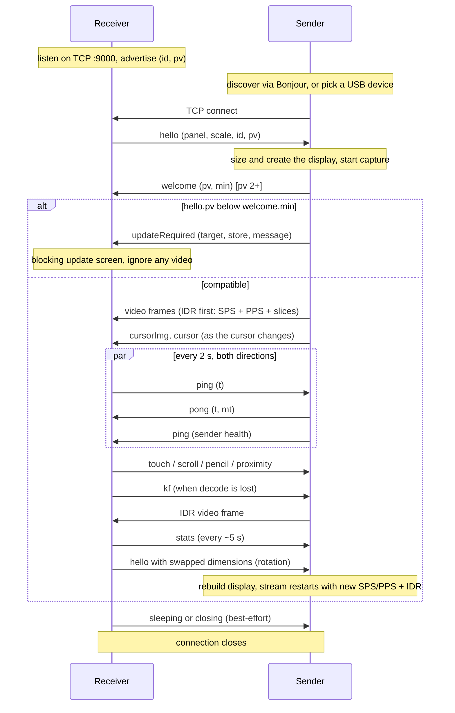

# OpenDisplay Wire Protocol

**Protocol version (`pv`): 7** &nbsp;|&nbsp; Status: **normative** for `pv <= 7`

This document specifies the wire protocol spoken between an OpenDisplay
*sender* (the machine whose desktop is extended, the Mac app today) and an
OpenDisplay *receiver* (the device that shows the extra display, the
iPhone/iPad app today). It describes everything that crosses the socket and
nothing that happens on either side of it: display creation, capture,
encoding, decoding, rendering, and input injection are implementation
details of each end and are out of scope (see [Appendix B](#appendix-b-implementers-notes-non-normative)
for non-normative hints).

Two companion documents:

* [COMPATIBILITY.md](COMPATIBILITY.md) is the policy for *evolving* this
  protocol: version negotiation rationale, the additive-by-default rule, and
  the two-phase procedure for breaking changes. This document describes the
  wire as it is; that one describes how it changes.
* [README.md](README.md) gives the product-level overview.

### Naming

The protocol is named the **OpenDisplay protocol** after the product. For
historical reasons the Bonjour service type is `_opensidecar._tcp` (the
project's original name) and it stays that way: renaming it would break
every deployed peer for zero functional gain. Do not read anything into the
mismatch.

### No support commitment

This specification exists so that independent implementations can
interoperate with the official apps and with each other. Publishing it is
**not** a commitment to ship official apps for other platforms, to keep
the protocol frozen, or to support third-party implementations. Issues
caused by third-party clients should be reported to those projects.

### Conventions

The key words MUST, MUST NOT, SHOULD, SHOULD NOT, and MAY are to be
interpreted as described in [RFC 2119](https://www.rfc-editor.org/rfc/rfc2119).
Every requirement applies to `pv` 7 unless a different version is called
out. "The official apps" means the Mac sender and iOS receiver in this
repository; their behavior is cited as illustration, not as requirement,
unless marked normative.

---

## 1. Roles and transport

* The **receiver listens** on TCP port **9000** and advertises itself.
* The **sender connects** to the receiver.

This role assignment is the most load-bearing decision in the protocol and
MUST be preserved: because the receiver is always the listening end, the
sender reaches it identically over WiFi (dial the discovered address) and
over USB (dial a tunneled port), and one code path serves both transports.

* The protocol runs over a **single TCP connection**. Video, control
  messages, and telemetry all share it, in both directions. The one
  optional exception is the UDP cursor side channel (section 6.3), which
  carries nothing a receiver cannot also get over TCP.
* There is no TLS and no authentication at `pv` 3. The protocol is designed
  for trusted local networks and direct cables. Implementations SHOULD
  disable Nagle's algorithm (TCP_NODELAY); input events are tiny packets and
  coalescing them reads as input lag.
* A receiver serves **one sender at a time**. When a new inbound connection
  arrives while one is active, the receiver MUST adopt the new connection
  and drop the old one (the official receiver cancels the old connection
  and resets its decoder state).

## 2. Transport bindings

The core protocol is transport-agnostic beyond "a TCP byte stream to port
9000 on the receiver". How the sender finds that port is a *binding*. Two
bindings exist today; ports to other platforms MAY define their own (for
example an Android receiver reachable over `adb reverse`) without touching
anything else in this document.

### 2.1 WiFi / LAN (Bonjour)

The receiver advertises a Bonjour (mDNS/DNS-SD) service:

* **Type:** `_opensidecar._tcp`
* **Name:** a human-readable, user-editable device name (defaults to the
  device's name). The name is display-only. It MUST NOT be used as a device
  identity: users rename devices, and two devices can share a name.
* **TXT record keys:**

| Key | Value | Since | Meaning |
|---|---|---|---|
| `id` | UUID string | pv 1 era | Stable per-install identity. MUST equal the `id` later sent in `hello`. Lets a sender recognize "same device, different transport/name". |
| `pv` | decimal integer as string, e.g. `"3"` | pv 2 | The receiver's protocol version. Absent means `pv` 1. Lets a sender evaluate compatibility before dialing. |

Senders MUST tolerate an absent TXT record and absent keys (pre-`pv` 2
receivers advertise neither).

### 2.2 USB (Apple devices)

For iPhones/iPads on a cable, the sender dials through **usbmuxd**, the
device-multiplexing daemon that ships with macOS and is available on Linux
and Windows via [libimobiledevice](https://libimobiledevice.org). The
sender asks usbmuxd to `Connect` to TCP port 9000 on the chosen device;
after the `OK` result the usbmuxd socket becomes a transparent byte pipe
and the protocol proceeds exactly as over WiFi.

Bonjour plays no role on this path. The official receiver classifies a
connection arriving from loopback as "USB" purely for its stats display;
this has no protocol significance.

## 3. Framing

Every message in **both directions** is length-prefixed:

```
[4-byte payload length, unsigned, big-endian][payload]
```

* The length counts the payload only, not the 4 header bytes.
* A frame is either a **video frame** (section 5) or a **control message**
  (section 6), distinguished as described in section 4.
* **Receiver to sender**, the payload MUST be `1` to `2^20 - 1` bytes. The
  official sender treats a length of 0 or `>= 2^20` as a protocol error and
  stops reading control messages on that connection.
* **Sender to receiver**, no hard maximum is enforced, but control messages
  are constrained by the demux rule below and video frames SHOULD stay in
  the low megabytes (a keyframe of a large panel).
* TCP gives no message boundaries: receivers of either role MUST buffer and
  reassemble; a frame MAY arrive split across many socket reads or packed
  together with others in one read.

## 4. Channel demux (deprecated heuristic)

All receiver-to-sender frames are JSON control messages, so the sender
needs no demux.

Sender-to-receiver frames carry both H.264 video and JSON control messages
on the same connection. At `pv <= 3` the receiver distinguishes them
**heuristically**. A frame is a JSON control message if and only if all
three hold:

1. payload length `< 32768` bytes, and
2. the first byte is `{` (0x7B), and
3. the payload contains no NUL byte (0x00).

Anything else is a video frame. This works because Annex B start codes
(`00 00 00 01`) guarantee NUL bytes in every video frame, including video
frames that *begin* with `{` (the telemetry prefix, section 5.1).

Consequences that are **normative for senders**:

* A sender MUST NOT emit a control message that is 32768 bytes or longer,
  starts with anything but `{`, or contains a NUL byte. The largest
  official control message, the base64 cursor sprite (`cursorImg`), caps
  its PNG at 24000 bytes precisely to stay under this limit after base64
  expansion.
* A sender MUST NOT emit a video frame that satisfies the JSON test (this
  cannot happen with well-formed Annex B payloads).

**Deprecation.** This heuristic is a design debt, not a feature. It is
specified here so that `pv <= 4` implementations agree on it, and it is
**expected to be replaced by a typed frame header in a future `pv`** (a
discriminator between the length prefix and the payload). The change will
follow the two-phase procedure in COMPATIBILITY.md section 6: a release
that understands both framings, then, after adoption, a release that
requires the new one. Implementers SHOULD isolate the demux decision in
their code so the swap is cheap, and MUST NOT build features that depend on
the heuristic's edge cases (for example, deliberately sending binary
control data to route it to the video path).

## 5. Video

The video stream is **H.264 Annex B**, one *access unit* (one encoded
picture) per wire frame.

### 5.1 Frame layout

```
[optional telemetry prefix: JSON, no start codes]
[00 00 00 01][NALU] [00 00 00 01][NALU] ...
```

* **Telemetry prefix.** Everything before the first start code, if
  anything, is a JSON object stamped by the sender:
  `{"cap":<ms>,"snd":<ms>}` where `cap` is the capture timestamp and `snd`
  the send timestamp, both milliseconds since the Unix epoch on the
  sender's clock. Receivers MUST tolerate its absence and MUST ignore
  unknown fields; it exists only for latency measurement (combined with the
  clock offset from section 8.1). Senders SHOULD include it.
* **Start codes are always 4 bytes** (`00 00 00 01`). Senders MUST NOT emit
  3-byte start codes; receivers MAY therefore split on the 4-byte pattern
  only. (A receiver that also handles 3-byte codes works today by accident;
  do not rely on it in either direction.)
* **Keyframes carry their parameter sets.** Every IDR frame MUST be
  prefixed with the current SPS and PPS NALUs. Non-keyframes carry only
  slice data (plus optional SEI, which receivers MAY skip).
* All slices of one picture MUST travel in one wire frame; receivers SHOULD
  decode each wire frame as one sample.
* **No presentation timestamps** cross the wire. The stream is low-latency
  (no B-frames in the official sender); receivers display frames in arrival
  order, as fast as they arrive.

### 5.2 Stream changes

The encoded video size is chosen by the sender and MAY differ from the
panel size announced in `hello` (the official sender offers reduced-scale
quality presets). Receivers MUST take the video dimensions from the SPS,
never from `hello`.

When the stream changes size (device rotation, quality change), the sender
simply starts sending frames with new SPS/PPS. Receivers MUST detect the
parameter-set change, rebuild their decoder, and discard buffered frames
from the old format.

### 5.3 Keyframe recovery

A receiver that cannot decode (it joined mid-GOP, lost its decoder, or
resumed from background) requests a keyframe with the `kf` control message
(section 6.1). The sender MUST respond by making the next transmitted frame
an IDR (with SPS/PPS, per 5.1). Senders SHOULD also send an IDR unprompted
whenever a connection is (re)established, including replaying the last
captured frame if the screen is static and the capturer produces nothing.

## 6. Control messages

Control messages are JSON objects encoded as UTF-8, each in its own frame
(section 3), each with a **`type`** field holding a string discriminator.
All other fields are type-specific.

Two rules make the protocol evolvable, and both are **normative**:

* **Unknown `type` values MUST be ignored** (logging is fine, but at most
  once per type, not per message: input types arrive at hundreds of
  messages per second). A newer peer may send types this implementation
  predates; that is normal, not an error.
* **Unknown fields on a known type MUST be ignored**, and optional fields
  MUST be tolerated when absent. New fields are added without a version
  bump.

An unparseable control payload (not JSON, or no `type`) MUST be ignored,
not treated as fatal.

Numbers are JSON numbers; nothing distinguishes int from float on the wire.
Coordinates use the conventions of section 7.

### 6.1 Receiver to sender

| `type` | Since | Fields | Purpose |
|---|---|---|---|
| `hello` | pv 1 | `pixelsWide`, `pixelsHigh`, `scale`, `device`?, `id`?, `pv`?, receiver UI fields? | Identify the panel; (re)sent on connect, rotation, or receiver UI preference change |
| `ping` | pv 1 | `t` | Liveness + clock sync probe |
| `touch` | pv 1 | `phase`, `x`, `y`, `t`? | Finger input |
| `scroll` | pv 1 | `dx`, `dy` | Two-finger scroll |
| `gesture` | pv 1 | `name` | Semantic receiver gesture |
| `pencil` | pv 3 | `phase`, `x`, `y`, `pressure`, `azimuth`, `altitude`, `rotation`, `t`? | Stylus input |
| `proximity` | pv 3 | `entering`, `x`, `y` | Stylus hover enter/leave |
| `keyboard` | pv 4 | `action`, plus fields per `action` (below) | Keyboard input |
| `pointer` | pv 5 | `action`, plus fields per `action` (below) | Pointer/click gestures |
| `displayModeRequest` | pv 7 | `mode` (`mirror` or `extend`) | Request a Mac-authoritative mode transition |
| `allowInputRequest` | pv 8 | `allowed` (bool) | Request the Mac-authoritative input gate state |
| `kf` | pv 1 | none | Request an IDR (section 5.3) |
| `stats` | pv 1 | free-form | Receiver-side telemetry for the sender's log |
| `sleeping` | pv 2 | none | Device locked; session ends, reconnect on wake expected |
| `closing` | pv 2 | none | App quit; session ends for good |

**`hello`** MUST be the first message a receiver sends on every new
connection, because the sender sizes its virtual display from it and can do
nothing before it arrives.

* `pixelsWide`, `pixelsHigh` (int): the panel size in **physical pixels**,
  in the panel's **current orientation** (portrait swaps them).
* `scale` (number): the device's UI scale factor (2 or 3 on Apple
  hardware). The sender uses it to pick a sensible point-size for the
  virtual display.
* `device` (string, optional): device kind for UI text, `"iPhone"` or
  `"iPad"` from the official receiver. Free-form.
* `id` (string, optional): stable per-install UUID. MUST match the Bonjour
  TXT `id`. Senders use it to recognize the same physical device across
  transports and renames.
* `pv` (int, optional): the receiver's protocol version. **Absent means
  1** (every pre-handshake install).
* `cursorPort` (int, optional): a UDP port on the receiver that accepts
  cursor datagrams (section 6.3). Present only while that listener is
  actually bound. Absent means the receiver takes cursor positions over
  TCP only. Additive at `pv` 3, no bump.
* `addrs` (array of strings, optional): every IP address the receiver is
  reachable on (section 6.4). Link-local IPv6 entries carry no zone id.
  The receiver SHOULD re-send `hello` when this set changes (a cable
  plugged mid-session creates the interface the sender must probe).
  Additive at `pv` 3, no bump.
* `maxEncodeWide` / `maxEncodeHigh` (int, optional): the receiver's decode
  ceiling in pixels (section 6.5) — the largest stream it can sustain,
  independent of the panel size it announced. Additive at `pv` 3, no bump.
* `trayEnabled` / `keyboardButtonEnabled` (bool, optional, pv 6): the
  receiver's persisted local UI preferences. They let the sender present
  per-receiver controls initialized to the receiver's actual state.

A receiver MUST re-send `hello` on the live connection whenever its
announced dimensions change (rotation). The sender rebuilds the display in
response; the official sender debounces this by 300 ms so an orientation
flurry settles into one rebuild, and replies to *every* `hello` with a
fresh `welcome` (receivers treat repeats idempotently).

**`ping`** carries `t` (number): milliseconds since the Unix epoch on the
receiver's clock. The sender MUST reply with `pong` echoing `t` (section
6.2, 8.1). Receivers SHOULD ping every ~2 s; see section 8.2 for why this
cadence is load-bearing.

**`touch`** carries `phase` (string): one of `"began"`, `"moved"`,
`"ended"`, `"cancelled"`; `x`, `y` (numbers): normalized position (section
7); `t` (number, optional): the event timestamp expressed **in the
sender's clock** (the receiver adds its measured clock offset before
stamping, so the sender can compute input latency without its own sync).
Senders MUST tolerate an absent `t` (it is omitted until the offset is
known).

**`scroll`** carries `dx`, `dy` (numbers): scroll deltas in **video
pixels** (section 7) with **natural-scrolling sign** (content follows the
fingers: fingers moving down produce positive `dy` and the scrolled content
moves down).

**`gesture`** carries `name` (string), identifying a semantic gesture rather
than a sequence of touch events. The sender MUST ignore unknown names. The
official receiver recognizes these gestures:

* `"missionControl"`: three-finger swipe up.
* `"appExpose"`: three-finger swipe down.
* `"nextSpace"`: three-finger swipe left.
* `"previousSpace"`: three-finger swipe right.
* `"showDesktop"`: four- or five-finger spread.
* `"launchpad"`: four- or five-finger pinch.

Three-finger gestures require a directional movement rather than a tap; the
four- and five-finger gestures require a meaningful change in fingertip
spread. These semantic messages do not replace touch or scroll messages for
ordinary input.
This additive message does not require a protocol-version bump.

**`pencil`** (pv 3) carries `phase` (string): `"down"`, `"move"`, `"up"`,
or `"hover"`; `x`, `y`: normalized position; `pressure` (number): 0 to 1;
`azimuth`, `altitude` (numbers): stylus orientation in radians (altitude
pi/2 = perpendicular to the screen); `rotation` (number): barrel roll in
radians, currently always 0; `t`: as in `touch`. A `"move"` while the pen
is up is a hover move.

**`proximity`** (pv 3) carries `entering` (bool) and the normalized `x`,
`y` where the stylus entered or left hover range.

**Pencil fallback (normative):** a receiver MUST NOT send `pencil` or
`proximity` to a sender whose `pv` is below 3; it MUST degrade the stylus
to `touch` events instead. (An old sender would ignore the unknown types
and the stylus would go dead; the fallback keeps it usable.)

**`keyboard`** (pv 4; extended at pv 6) carries `action` (string): `"text"`,
`"press"`, `"down"`, `"up"`, `"modifierDown"`, `"modifierUp"`, or `"cancel"`, plus fields specific to it:

* `"text"` — committed Unicode text: `text` (string), the finished
  characters to type (a whole composed/IME commit, an emoji, or an ordinary
  run of typed characters — never intermediate/marked composition state).
  `{"type":"keyboard","action":"text","text":"…"}`
* `"press"` — one atomic key with no down/up lifecycle to track: `usage`
  (int), a USB HID keyboard-page (0x07) usage number (below), and optional
  named `modifiers` (pv 6) for shortcut execution.
  `{"type":"keyboard","action":"press","usage":42}`
* `"down"` / `"up"` — a hardware key's lifecycle, for keys a sender must
  hold (arrows, modified shortcuts): `usage` (int, as above), `modifiers`
  (array of strings, optional, absent means none). Every `"down"` a
  receiver sends MUST be followed by a matching `"up"` (or by disconnect —
  senders MUST release a still-held key on session loss regardless).
  `{"type":"keyboard","action":"down","usage":80,"modifiers":["shift"]}`
* `"modifierDown"` / `"modifierUp"` (pv 6) — a synthetic modifier's held
  lifecycle: `modifier` is one of `"command"`, `"option"`, `"control"`, or
  `"shift"`. Every down MUST be followed by an up; senders MUST also release
  all held modifiers on pause, input disable, migration, or session loss.
* `"cancel"` (pv 6) — release every synthetic input state held for this
  session. Receivers send it before hiding or materially changing the active
  control profile; it is idempotent.

Named protocol modifiers (not raw platform modifier bit masks): `"shift"`,
`"control"`, `"option"`, `"command"`, `"capsLock"`. Senders MUST ignore
unrecognized modifier names.

`usage` values are USB HID Usage Tables keyboard-page (0x07) usage numbers.
Senders MUST validate `usage` (an integral value in `0...65535`) and MUST
ignore an out-of-range, non-integral, or unrecognized value rather than
treat it as fatal. The keys the official apps exchange today:

| Usage | Key |
|---|---|
| 40 | Return / Enter |
| 41 | Escape |
| 42 | Delete / Backspace |
| 43 | Tab |
| 44 | Spacebar |
| 76 | Delete Forward |
| 79 | Right Arrow |
| 80 | Left Arrow |
| 81 | Down Arrow |
| 82 | Up Arrow |

**Keyboard fallback (normative):** a receiver MUST NOT send `keyboard`
messages to a sender whose `pv` is below 4, and SHOULD NOT offer keyboard
input UI at all while connected to one (there is no legacy fallback path —
unlike pencil, a receiver simply has nothing useful to degrade to).

**`pointer`** (pv 5) carries `action` (string): `"move"`, `"moveRelative"`,
`"down"`, or `"up"`, plus fields specific to it. Decouples cursor movement
from button state — unlike `touch`, moving the pointer never implies a
mouse button, and a button press/release is a separate, explicit message
carrying its own click count and button identity:

* `"move"` — absolute cursor move: `x`, `y` (numbers), normalized position
  (section 7). No button implied.
  `{"type":"pointer","action":"move","x":0.42,"y":0.7}`
* `"moveRelative"` — relative cursor move from the Mac's own current
  cursor position (never a touch location): `dx`, `dy` (numbers), in
  **video pixels** (section 7), same convention as `scroll`'s deltas. No
  button implied.
  `{"type":"pointer","action":"moveRelative","dx":4,"dy":-2}`
* `"down"` — a mouse button going down at the Mac's *current* cursor
  position: `button` (string, `"left"` or `"right"`), `clickCount` (int,
  1/2/3 for single/double/triple click — mirrors
  `NSEvent.clickCount`/`CGEventClickState`). Every `"down"` a receiver
  sends MUST be followed by a matching `"up"` (or disconnect — senders
  MUST release a still-held button on session loss regardless, same
  contract as `keyboard`'s `"down"`/`"up"`).
  `{"type":"pointer","action":"down","button":"left","clickCount":1}`
* `"up"` — the matching release: `button`, `clickCount` (as above).
  `{"type":"pointer","action":"up","button":"left","clickCount":1}`

Senders MUST validate `button` and MUST ignore an unrecognized value
rather than treat it as fatal (a future button name is a no-op, not a
disconnect).

**Pointer fallback (normative):** a receiver MUST NOT send `pointer`
messages to a sender whose `pv` is below 5; it MUST degrade to the legacy
`touch` click-drag behavior instead (finger down/moved/up mapped straight
to left mouse down/dragged/up, as before pv 5) — there is a full working
fallback, unlike keyboard, so pointer/click gestures degrade gracefully
rather than disappearing.

**`stats`** is free-form telemetry the sender only logs, so both ends stay
diagnosable from one log file. The official receiver sends it every ~5 s
with fields like `transport`, `fps`, `mbps`, `e2e50`, `e2e95`, `enc50`,
`rtt`, `stalls`, `dec50`, `ph50`, `ph95`, `offsetKnown`. No field is
normative; senders MUST accept any object.

**`sleeping`** and **`closing`** let the
sender distinguish "device locked, it will come back" (keep listening for a
wake, tear the display down in the meantime) from "user quit the app" (end
the session, stop redialing). Both are courtesy messages sent best-effort
right before the receiver closes the connection; senders MUST NOT rely on
receiving them (a cut cable produces neither).

### 6.2 Sender to receiver

These ride the same connection as video and MUST satisfy the demux rule of
section 4.

| `type` | Since | Fields | Purpose |
|---|---|---|---|
| `pong` | pv 1 | `t`, `mt` | Clock-sync reply |
| `ping` | pv 1 | `drops`?, `encDrops`?, `netDrops`?, `pending`?, `inp50`?, `inp95`?, `capFps`? | Liveness + sender health |
| `cursor` | pv 1 | `x`?, `y`?, `v` | Cursor position/visibility |
| `cursorImg` | pv 1 | `nw`, `nh`, `ax`, `ay`, `png` | Cursor sprite |
| `welcome` | pv 2 | `pv`, `min` | Sender's side of the version handshake |
| `updateRequired` | pv 2 | `target`, `store`, `message` | Peer must update to continue |
| `displayState` | additive | `state` (`running` or `paused`) | Capture pause state for receiver UI/input gating |
| `receiverUI` | pv 6 | `trayEnabled`?, `keyboardButtonEnabled`? | Update persisted receiver-local UI preferences |
| `inputReset` | pv 6 | none | Clear the receiver's local latched/temporary modifier state |
| `displayModeState` | pv 7 | `mode` (`mirror` or `extend`) | Mac-authoritative confirmed capture mode |
| `allowInputState` | pv 8 | `allowed` (bool) | Mac-authoritative input gate state |

**`pong`** echoes the `t` from the receiver's `ping` unchanged and adds
`mt`: milliseconds since the Unix epoch on the sender's clock at the moment
of the reply. See section 8.1.

**`ping`** (sender-to-receiver) is primarily a liveness beat (section
8.2). The official sender piggybacks send-side health counters on it for
the receiver's performance overlay: `encDrops`/`netDrops` (frames dropped
at the encoder / network stage), `drops` (legacy combined counter, superseded
by `encDrops`), `pending` (in-flight sends), `inp50`/`inp95` (input latency
percentiles, ms), `capFps` (capture rate). All fields optional,
informational only. Note the asymmetry: the receiver's `ping` solicits a
`pong`; the sender's does not.

**`cursor`**: `v` is 1 (visible) or 0 (hidden). When visible, `x`, `y`
give the normalized position (section 7); when hidden they MAY be absent.
The cursor rides the control path rather than being baked into the video
so it moves at input rate, not at video latency; the official sender emits
up to 120 updates/s, deduplicated by movement threshold. Receivers without
cursor rendering MAY ignore both cursor messages.

**`displayState`** carries `paused` when the user pauses capture and
`running` after every successful capture start, including initial capture,
resume, mode replacement, and recovery. Receivers SHOULD keep the last video
frame visible and indicate that the display is paused; they SHOULD ignore
interactive input while paused. This is additive and unknown message types
remain safe to ignore.

**`receiverUI`** updates only the supplied receiver-local preference fields;
missing and unknown fields are ignored. **`inputReset`** accompanies a sender
input-disable transition so the receiver cannot retain a visually latched
modifier after the sender has safely released its synthetic input state.

**`displayModeRequest`** (receiver → Mac, pv 7) carries `mode` (`mirror` or
`extend`). The Mac owns the transition and MUST use its normal capture/display
mode path rather than treating the request as confirmation. Once setup has
succeeded, it sends **`displayModeState`** with the actual active mode. It also
sends that state after Mac-originated changes and on a newly established
session, so the receiver never infers mode from dimensions or display shape.

A failed transition produces no reply at all — the sender MUST NOT confirm a
mode it did not enter. A mode switch normally rebuilds the sender's session,
so the confirming `displayModeState` legitimately arrives on the *next*
connection; receivers SHOULD therefore keep a request outstanding across that
reconnect, and SHOULD retire it on a local deadline rather than wait forever.

**`cursorImg`** delivers the current cursor sprite: `png` is the base64 of
a PNG (kept under 24000 bytes pre-encoding, see section 4); `nw`, `nh` are
the sprite's width/height **normalized to the display size**, so the
receiver can scale it without knowing the sender's HiDPI factor; `ax`, `ay`
are the hotspot **normalized within the sprite** (0..1 of its own size).
Sent when the sprite changes and re-sent after reconnects.

### 6.3 Cursor side channel (UDP)

Cursor positions share the TCP connection with video frames of several
hundred KB. Over WiFi one late frame holds every cursor update queued
behind it (head-of-line blocking), and the cursor stutters while the video
is fine. The side channel moves the position messages, and only those, onto
UDP where a lost or late datagram costs nothing: the next one supersedes it.

* **Capability-gated and optional.** A receiver that offers it binds a UDP
  listener (the official receiver uses TCP port + 1, so 9001 by default)
  and advertises the port as `hello.cursorPort`. A sender that sees no
  `cursorPort`, or cannot reach it, MUST keep sending `cursor` over TCP.
  Either side may lack the feature with no loss beyond cursor smoothness.
* **Bindings.** WiFi/LAN only. usbmuxd (section 2.2) tunnels TCP streams
  and cannot carry UDP; a sender on the USB binding MUST ignore
  `cursorPort`. The sender dials the same host the TCP connection reached.
* **Datagram format.** One datagram is one `cursor` message (section 6.2)
  as UTF-8 JSON, without the 4-byte length prefix, plus `s` (unsigned
  integer): a sequence number that starts at 1 and increments by one per
  datagram sent, e.g. `{"type":"cursor","x":0.4210,"y":0.7735,"v":1,"s":88}`.
  Nothing but `cursor` messages travel here; `cursorImg` stays on TCP
  because a sprite must arrive intact.
* **Sequence semantics.** The receiver keeps the highest `s` seen and MUST
  drop any `cursor` message — datagram or TCP frame — whose `s` is not
  greater than it (UDP reorders, and around a path switch a TCP frame
  queued behind video can arrive after a newer datagram). The sequence is
  per TCP session: it restarts when the TCP connection is (re-)established
  and runs across both paths. The receiver resets its tracker on every new
  TCP connection and on every new UDP flow, and accepts datagrams only
  from the most recently seen flow. A TCP `cursor` frame without `s` (an
  older sender) applies unconditionally.
* **Delivery confirmation.** `.ready` on a UDP socket proves only a local
  route — a firewalled port would swallow the cursor silently. On the
  first accepted datagram of a flow the receiver sends `cursorAck` (a
  control message with no other fields) over TCP. Until it arrives the
  sender MUST keep mirroring every position onto TCP (same `s`, so the
  receiver deduplicates); if no ack arrives within a few seconds the
  sender SHOULD drop the UDP flow and stay on TCP. A receiver that stops
  listening mid-session SHOULD re-send `hello` without `cursorPort` to
  withdraw the offer.
* **Mixing.** A sender MAY switch between UDP and TCP for `cursor` at any
  time. Both deliver into the same cursor state on the receiver.
* **Firewall note.** A receiver offering the channel now also listens on
  UDP (port + 1 for the official receiver). The official Mac receiver
  therefore needs UDP 9001 open in addition to TCP 9000.

### 6.4 Cable upgrade (`hello.addrs`)

A Mac-to-Mac cable — Thunderbolt/USB4 (Thunderbolt Bridge) or plain USB-C
on recent macOS (host-to-host networking, gated by the "allow accessory"
consent on each Mac) — appears as a network interface on both ends. It is
always the better path than WiFi, but nothing guarantees a Bonjour dial
lands on it: mDNS resolution under an interface-restricted dial can stall,
and an unrestricted dial races all resolved addresses and often keeps
WiFi.

`hello.addrs` closes the gap. A receiver that can carry a session over a
host-to-host cable (today: a Mac — a cabled phone reaches the sender over
usbmuxd instead, and a phone's advertised WiFi address would only invite
a false "upgrade" onto a path that still crosses its radio) lists the
addresses it is reachable on; a sender whose live TCP session runs over WiFi SHOULD
periodically probe those addresses (link-local IPv6 re-scoped to each of
its own plausible interfaces) with WiFi forbidden, and on the first probe
that connects over a non-WiFi path, move the session onto it: the probe
connection simply becomes the session connection, and the receiver's
newcomer handling (a newcomer proves itself with bytes before it may
replace a live session) swaps it in cleanly. The abandoned WiFi socket is closed
by the sender. A sender already on a wired path, or on the USB (usbmuxd)
binding, does not probe.

The upgrade is one-way by design. When the sender judges that a session
rides the direct host-to-host cable — a wired path, to a link-local peer
address (fe80::/10 or 169.254/16), on a receiver class that can be cabled
(today: a Mac; all three conditions, since link-local peers also occur on
bridged or DHCP-less LANs where no cable joins the two machines) — it
SHOULD treat the death of that connection as intent and end the session
rather than redial over WiFi: pulling the cable is how a person
deliberately ends a session, and a WiFi fallback would resurrect what
they just closed. Every other session death keeps the reconnect loop: a
radio drop is never intent, and a routed wired path (a docked sender
streaming to a receiver on WiFi) going quiet says nothing about a cable.
Once a sender decides to redial, the dial's own failures follow the
normal reconnect rules — only the death of the live cable connection
itself is intent.

**`welcome`**: the sender's `pv` and `min` (the oldest receiver `pv` it
still supports). Sent in response to every `hello`. A receiver whose own
`pv` policy is not met by the sender (`welcome.pv < ` its minimum) is the
only party that can detect an outdated sender and SHOULD tell its user to
update the sender. A receiver that never gets a `welcome` at all is talking
to a pre-pv-2 sender and MUST assume sender `pv` 1.

**`updateRequired`**: the sender declares the pairing unsupported until the
receiver updates. `target` names the end that must act (`"ios"` today),
`store` is a platform-appropriate update URL, `message` is user-facing
prose. Receivers SHOULD surface it prominently and stop expecting video —
but MUST NOT depend on the video actually stopping: the official sender
currently keeps streaming after sending it and relies on the receiver to
block its own UI. At `pv` 3 this is only sent when
`hello.pv < welcome.min`, which never happens while `min` is 1; the
machinery exists so a future floor raise degrades into a clear message
instead of a silent failure.

### 6.5 Decode ceiling (`hello.maxEncodeWide` / `maxEncodeHigh`)

`hello.pixelsWide/High` sets the desktop size, and without further
information it also sets the stream size — but a big panel says nothing
about the decoder behind it. Measured end to end, H.264 hardware decode
stops below 5120 pixels wide on every Mac tested, current models
included: a 5K panel asking for a 5K H.264 stream gets a session the
receiver cannot sustain, which degrades confusingly instead of failing
cleanly.

Both fields are optional and additive (no `pv` bump). A receiver MAY
advertise the largest stream, in pixels, it can actually decode at
frame rate; a sender that understands the fields SHOULD keep the
desktop at the announced panel size and, when the stream it would
encode exceeds the ceiling, scale the stream down to fit inside it,
preserving aspect. A ceiling the stream already fits inside changes
nothing, and a receiver that omits the fields gets the previous
behavior (stream size follows the announced pixels and the sender's
quality setting). Derive advertised ceilings from measured playback: a
decode session that merely creates successfully proves nothing.

## 7. Coordinate spaces and units

The most common third-party bug is a unit mismatch, so here is every space
in one table. "Video space" is the decoded video image; its pixel size
comes from the SPS (section 5.2), and it always fills the receiver's
display area (the receiver letterboxes/scales as it sees fit; input is
normalized against the video, not the screen, so this never affects the
sender).

| What | Space | Units | Origin / sign |
|---|---|---|---|
| `hello.pixelsWide/High` | physical panel | pixels | current orientation |
| `hello.scale` | none | UI scale factor | n/a |
| `touch.x/y`, `pencil.x/y`, `proximity.x/y` | video | normalized 0..1 | top-left, x right, y down |
| `scroll.dx/dy` | video | **pixels** (not normalized) | natural-scrolling sign |
| `cursor.x/y` | video | normalized 0..1 | top-left |
| `cursorImg.nw/nh` | display | normalized to display width/height | n/a |
| `cursorImg.ax/ay` | sprite | normalized to sprite width/height | top-left of sprite |
| `pencil.azimuth/altitude/rotation` | physical | radians | altitude pi/2 = perpendicular |
| `ping.t`, `pong.t/mt`, telemetry `cap`/`snd`, `touch.t` | wall clock | ms since Unix epoch | see 8.1 for whose clock |

## 8. Time and liveness

### 8.1 Clock synchronization

The receiver measures the clock offset to the sender NTP-style over
`ping`/`pong`:

1. Receiver sends `ping` with `t = t1` (its clock).
2. Sender replies `pong` with the same `t` and `mt` (its clock).
3. Receiver, at arrival time `t2`, computes `rtt = t2 - t1` and
   `offset = mt - (t1 + t2) / 2`.

The official receiver discards samples with `rtt < 0` or `rtt >= 2000` ms,
keeps the last 15, and uses the offset of the **minimum-RTT sample** (the
sample least distorted by queueing). The offset feeds two things: mapping
the video telemetry prefix (`cap`, `snd`) onto the receiver's clock for
end-to-end latency, and stamping `touch.t`/`pencil.t` in the sender's
clock. All of this is measurement plumbing: an implementation that skips it
loses latency numbers and input timestamps, nothing else.

### 8.2 Liveness (normative)

Each end treats prolonged silence as a dead link:

* The official sender reconnects after **more than 5 s** without any bytes
  from the receiver.
* The official receiver drops the connection after **more than 5 s**
  without any bytes from the sender (a static screen produces no video
  frames, so this matters).

Therefore each end MUST transmit *something* at least every ~5 s while the
connection is up. The `ping` messages exist for exactly this; both official
apps send theirs every **2 s**. An implementation MAY use different
timeouts but SHOULD keep the 2 s ping cadence so it stays comfortably
inside its peer's window.

Reconnection policy is the dialing sender's business, not the protocol's.
For the record, the official sender: redials ~1 s after a failure, gives
each dial attempt 5 s (a dial to a withdrawn Bonjour name hangs forever
otherwise), and gives a previously connected device a **10 s grace**
before declaring the session over. It ends sooner when the evidence is
unambiguous: after `closing`, after a few actively refused dials in a row
(reachable device, nothing listening), or when the receiver's Bonjour
service withdraws while the connection is down. `sleeping` also ends the
session, but the sender keeps waiting for the device to come back.

## 9. Session lifecycle



Rules already stated elsewhere, gathered:

* `hello` first, on every connection (6.1). Video starts only after it.
* First frame after (re)connect is an IDR (5.3).
* Rotation is a re-`hello` on the live connection, not a reconnect (6.1).
* A new inbound connection replaces the current one (section 1).
* Silence over ~5 s is death (8.2); `sleeping`/`closing` are best-effort
  courtesies, absence of them means nothing (6.1).

## 10. Versioning and evolution

Mechanics at a glance (the policy behind them lives in COMPATIBILITY.md):

* `pv` is a single integer, bumped **only when the wire changes**, never
  per release. Current: **3**.
* A peer that advertises no `pv` anywhere (TXT, `hello`, `welcome`) **is**
  protocol 1.
* Each side declares the oldest peer it supports (`welcome.min` on the
  wire; both official apps currently declare 1). `hello.pv < welcome.min`
  triggers `updateRequired`; `welcome.pv` below the receiver's own floor
  triggers a "update the sender" surface on the receiver.
* **Additive changes are free**: new optional fields and new message types
  need no bump, because unknown types and fields MUST be ignored (section
  6). Features that need both ends (like `pencil`) gate on the peer's `pv`
  and degrade below it.
* **Breaking changes are two-phase** (support both, saturate, then raise
  the floor and drop the old path). Never silent.

### State of the wire

| `pv` | Introduced |
|---|---|
| 1 | Baseline: framing, demux heuristic, video format, `hello`, `ping`/`pong`, `touch`, `scroll`, `kf`, `stats`, `cursor`, `cursorImg`, Bonjour TXT `id` |
| 2 | Version handshake: `pv` in `hello` and TXT, `welcome`, `updateRequired`, `sleeping`, `closing` |
| 3 | `pencil`, `proximity`; below pv 3 the receiver degrades stylus to `touch` |
| 3 (additive) | `hello.cursorPort` and the UDP cursor side channel (6.3); optional, no bump |
| 4 | `keyboard` (text/press/down/up); below pv 4 the receiver has no keyboard fallback and MUST NOT offer keyboard UI |
| 5 | `pointer` (absolute/relative movement, clicks, right button); below pv 5 the receiver uses legacy `touch` fallback |
| 6 | Receiver control-tray preference fields/messages; modifier down/up and modified atomic keyboard presses |
| 7 | Explicit `displayModeRequest` / authoritative `displayModeState` synchronization |
| 8 | Mac-authoritative `allowInputRequest` / `allowInputState` synchronization |

---

## Appendix A: Minimal implementations

What a third-party client actually has to do, distilled. MUSTs from the
body of the spec apply; this is the checklist form.

**A minimal receiver** (turn a device into a display, no input):
listen on 9000 (advertise via Bonjour if WiFi discovery is wanted), send
`hello` on connect, send `ping` every 2 s, deframe, apply the section 4
demux, feed video frames to an H.264 decoder honoring section 5 (skip the
telemetry prefix, watch for SPS/PPS changes), send `kf` when decode is
lost, ignore every control message it does not care about. `pong`
handling, stats, cursor rendering, and input are all optional layers on
top. The 74-line `tools/fake-receiver.swift` in this repository is a
working (video-discarding) example of the skeleton.

**A minimal sender**: discover or be told an address, dial 9000, wait for
`hello`, reply `welcome`, encode H.264 per section 5 (4-byte start codes,
SPS/PPS on every IDR, one picture per frame), send an IDR on connect and on
`kf`, send `ping` every 2 s, ignore unknown control types. Input injection
(`touch`, `scroll`, `pencil`) and cursor forwarding are optional layers.

## Appendix B: Implementer's notes (non-normative)

How the official apps fill in the parts the spec deliberately leaves open,
recorded as hints for porters:

* **Sender, display:** macOS `CGVirtualDisplay` (private API) sized from
  `hello`, captured with ScreenCaptureKit, encoded with VideoToolbox in
  real-time mode, no B-frames, periodic keyframes off (IDRs only on demand).
  Linux equivalents that third parties have used: a headless Wayland
  output; on Windows, an indirect display driver.
* **Sender, input:** `CGEvent` for touch-as-mouse and scroll, tablet
  events for pencil. Semantic system gestures use macOS keyboard shortcuts
  posted as flagged key-down/key-up events; the sender does not synthesize a
  trackpad gesture or use private multitouch APIs. `keyboard.text` posts a
  paired key-down/up carrying the whole string as a Unicode string
  (`CGEventKeyboardSetUnicodeString`); `press`/`down`/`up` post ordinary
  virtual-key `CGEvent`s. The sender tracks which hardware keys are held so
  it can release them all on pause, disconnect, transport migration, or
  input being disabled — the same cancellation path touch and pencil use.
* **Receiver, decode/present:** VideoToolbox decode into
  `AVSampleBufferDisplayLayer` (or a Metal layer). Android ports use
  `MediaCodec` + `SurfaceView`.
* **USB from non-Mac senders:** libimobiledevice's usbmuxd implementation;
  `iproxy` demonstrates the tunnel. For non-Apple *receivers*, defining an
  analogous binding (e.g. `adb reverse tcp:9000 tcp:9000`) is enough.
* The sender logs receiver `stats` lines prefixed `PHONE-STATS`, so one
  log file tells the whole story when debugging a session.

## Appendix C: Document history

This file is versioned by git; the authoritative change log is
`git log -- PROTOCOL.md`. Substantive revisions:

| Date | Change |
|---|---|
| 2026-08-19 | Initial specification, written against `pv` 3 |
| 2026-08-26 | Additive: `hello.cursorPort` and the UDP cursor side channel (section 6.3) |
| 2026-09-14 | `pv` 4: `keyboard` message family (native keyboard input, M4) |
| 2026-09-14 | `pv` 5: `pointer` message family; `pv` 6: adaptive receiver controls and modifier shortcuts |
| 2026-09-14 | `pv` 7: receiver mode requests and Mac-authoritative Mirror/Extend state |
