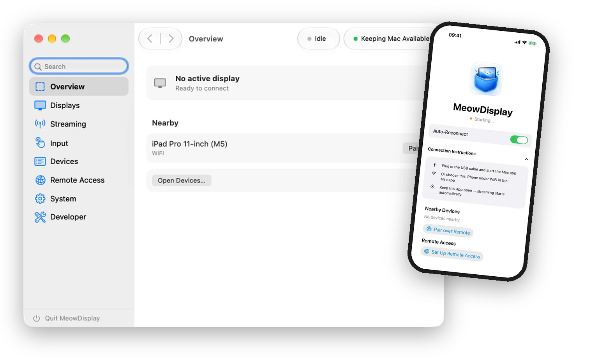
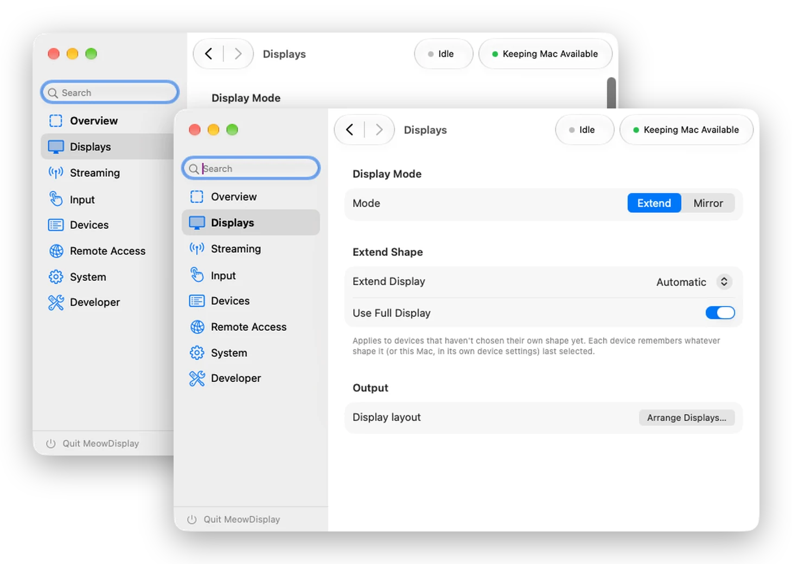
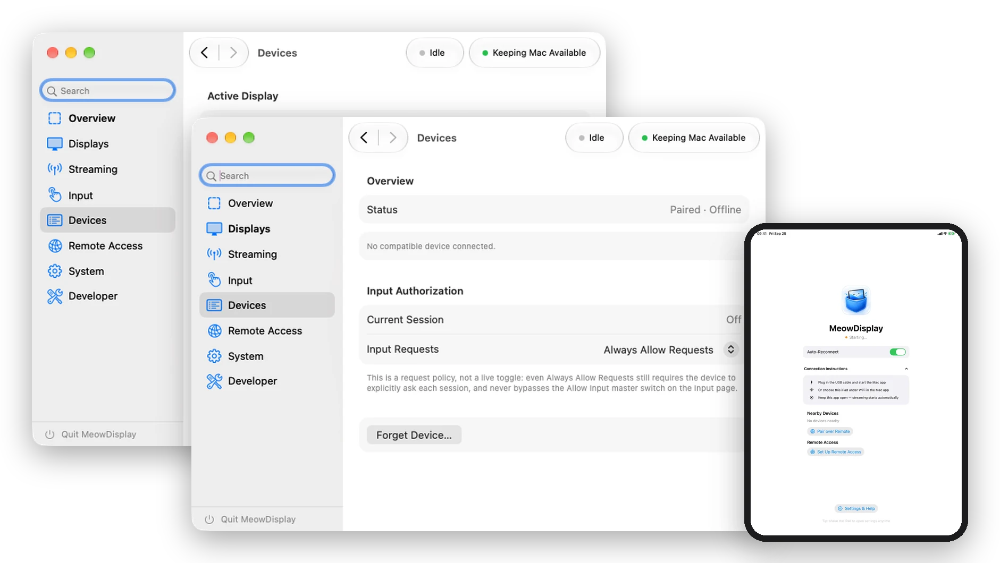

<div align="center">


# MeowDisplay

**Mac everywhere.<br>On whatever display.**

Use your iPhone or iPad as another display for your Mac — and control the Mac
right from it.

[Website](https://meowdisplay.app) ·
[Features](https://meowdisplay.app/features.html) ·
[Setup](https://meowdisplay.app/docs.html) ·
[Support](https://meowdisplay.app/support.html) ·
[Privacy](https://meowdisplay.app/privacy.html)

<br>



</div>

## Overview

MeowDisplay mirrors or extends your Mac onto an iPhone or iPad, then turns
that device into a way to work the Mac: touch, a trackpad-style pointer,
multi-finger gestures, a keyboard, and trays of modifiers and shortcuts all
travel back to the Mac. Connect over USB, local Wi-Fi, or a private network
you control, with devices paired and every session encrypted.

No MeowDisplay account is required, and there is no MeowDisplay-hosted relay
or server in the middle.

<sub>Public release builds are being prepared. Until then, MeowDisplay can be
[built from source](#build-from-source).</sub>

## At a glance

| | |
|---|---|
| **Display** | Mirror an existing Mac display, choosing the source when several are connected · Extend with a virtual display · Extend shape options, including Use Full Display, where supported |
| **Control** | Direct Touch · Trackpad mode · keyboard · click, drag and right-click · scroll, pinch and rotate · Mac system gestures |
| **Shortcuts** | Main Control Tray · Function Tray · Chords and modifier palettes · customizable actions · profiles · Auto-hide |
| **Connections** | USB · local Wi-Fi · Remote Access · Auto-Reconnect · Wake & Connect |
| **Audio** | Mac system audio on the receiver · Mac keeps playing locally · A/V sync and Resync |
| **Security** | Trusted pairing with a matching code · TLS 1.3 · pinned peer identity |
| **Receivers** | iPhone and iPad |

## Display: Mirror & Extend

<p align="center">

</p>

- **Mirror** shows an existing Mac display on the receiver. With more than
  one display connected, choose which one to mirror.
- **Extend** adds a separate virtual display to the Mac, arranged alongside
  your other displays in macOS. Where supported, Extend shape controls tune
  that display to the receiver, including an option to use the full display.

## Input & gestures

With **Allow Input** enabled on the Mac and Accessibility permission granted,
the receiver becomes an input device for the Mac. Choose an input mode in the
receiver's Settings:

- **Direct Touch** — a touch maps to the matching position on the Mac screen.
- **Trackpad** — the pointer moves relatively, like a MacBook trackpad.
  Touching doesn't jump the cursor to that spot. Sensitivity is adjustable,
  and multi-finger gestures keep working.

| Gesture | On your Mac |
|---|---|
| Tap | Click |
| Double tap | Double-click |
| Triple tap | Triple-click |
| Tap, then hold and move | Left drag |
| Two-finger tap | Right-click |
| Two-finger tap, then hold and move | Right-button drag |
| Two-finger pan | Scroll, with momentum |
| Pinch / spread | **Viewport**, **App**, or **Disabled** |
| Two-finger rotate | **Viewport**, **App**, or **Disabled**, with optional **Snap Rotation** |
| Two-finger double tap | Reset or restore the viewport zoom and pan |

### Mac system gestures

| Gesture | On your Mac |
|---|---|
| Three-finger swipe up | Mission Control |
| Three-finger swipe down | App Exposé |
| Three-finger swipe left / right | Next / Previous Space |
| Three-finger tap | Spotlight |
| Four- or five-finger spread | Show Desktop |
| Four- or five-finger pinch | Launchpad |

Full details are on the [Features page](https://meowdisplay.app/features.html#pointer).

### Trackpad mode, without the picture

Turn **Video** off and keep using MeowDisplay for pointer and keyboard input.
The connection, trays and selected input mode stay active, so the receiver
works as a trackpad and keyboard for the Mac.

### Keyboard

Tap the tray's Keyboard button for the on-screen keyboard, or use a hardware
keyboard connected to the iPhone or iPad. Latched modifiers from the Control
Tray combine with the keys you type.

## Control Trays & Chords

### Main Control Tray

The keys a touch screen is missing, close at hand: **Command**, **Option**,
**Control**, **Shift**, **Escape**, **Tab**, **Dock**, **Keyboard** and
**Settings**. Reorder controls, show or hide each one, and keep several
setups as profiles. Haptics, a landscape tray side, and Avoid Notch let it fit
the device you're holding.

### Chords

Hold or latch a modifier and a palette of matching shortcuts appears beside
it. Combine modifiers and the palette changes with the chord — for example
**⌘** for Copy, Paste and Undo, **⌘⌥** for Force Quit and Hide Others, **⌘⇧**
for Redo and Screenshot. Pick commands without reaching for a physical
keyboard, and choose which actions each palette offers.

### Function Tray

A separate tray of one-tap actions — **Zoom In**, **Zoom Out**, **Undo** and
**Redo** by default. It's customized independently of the Main Control Tray,
with its own profiles, and can sit on the same or the opposite side.

### Auto-hide

**There when you need it. Out of the way when you don't.** With Auto-hide, the
control trays retreat after a period of inactivity and interacting with the
receiver brings them back. Manual Collapse stays separate, and Auto-hide can
be turned off.

## Devices

<p align="center">

</p>

The Mac app manages every receiver: paired and nearby devices with their
status, per-device settings and input request controls, and **Forget
Device**. **Allow Input** on the Mac remains the master switch for whether
any receiver can control it.

## Connections

- **USB** — plug in a data-capable cable and trust the Mac. A direct,
  reliable path with no network setup.
- **Local Wi-Fi** — receivers are discovered over Bonjour on your network,
  including nearby peer-to-peer Wi-Fi.
- **Remote Access** — reach a paired Mac through a private network you
  control, such as Tailscale. The address only routes the connection; pairing
  still authenticates it.
- **Auto-Reconnect** restores the session whenever the connection becomes
  available again.
- **Wake & Connect** can wake a supported paired Mac on its network and
  reconnect when it becomes available. It needs Wake for Network Access and
  compatible hardware, and is designed for a logged-in Mac that has gone to
  sleep or locked. See
  [Setup](https://meowdisplay.app/docs.html) for networking limitations.

## Audio

Mac system audio can stream to the receiver while the Mac keeps playing
locally. Turn it on with the receiver's **Audio** toggle; if sound and picture
drift apart, adjust **A/V Sync** or tap **Resync**.

## Security

- Devices pair explicitly, confirming a matching verification code (SAS) on
  both screens.
- Every session is encrypted and mutually authenticated with **TLS 1.3**
  against the **pinned peer identity** you trusted.
- There is no plaintext media fallback.

More in [SECURITY.md](SECURITY.md) and the
[Privacy page](https://meowdisplay.app/privacy.html).

## Getting started

1. Run MeowDisplay on your Mac.
2. Open the MeowDisplay receiver on your iPhone or iPad.
3. Connect over USB or Wi-Fi, and pair the devices by confirming the matching
   code.
4. Choose **Mirror** or **Extend**.
5. Grant Screen Recording, Accessibility and Local Network permissions as
   macOS and iOS ask for them.

The [Setup guide](https://meowdisplay.app/docs.html) covers permissions,
pairing, USB & Wi-Fi, Remote Access and troubleshooting.

## Build from source

```sh
git clone https://github.com/raiseCatError/meowdisplay.git
cd meowdisplay
echo "DEVELOPMENT_TEAM=YOURTEAMID" > .env
./generate-local.sh
```

Open `MeowDisplay.xcodeproj` and run the `OpenSidecarMac` (Mac) and
`OpenSidecariOS` (iPhone/iPad receiver) schemes. Signing, permissions and
troubleshooting are in [SETUP.md](SETUP.md); release process in
[RELEASE.md](RELEASE.md).

## Documentation

- [Features](https://meowdisplay.app/features.html) ·
  [Setup](https://meowdisplay.app/docs.html) ·
  [Support](https://meowdisplay.app/support.html) ·
  [Privacy](https://meowdisplay.app/privacy.html)
- [SETUP.md](SETUP.md) — building, signing and local setup
- [SECURITY.md](SECURITY.md) — security model and reporting issues
- [PROTOCOL.md](PROTOCOL.md) and [COMPATIBILITY.md](COMPATIBILITY.md) — wire
  protocol and versioning
- [TECHNICAL_NOTES.md](TECHNICAL_NOTES.md) — virtual displays, sleep and
  wake, and other internals

## Contributing

Issues and pull requests are welcome, especially testing on iPad, different
Mac models, external-display setups and networks. Please open an issue before
starting large architecture work.

## License & credits

MeowDisplay is licensed under [GPL-3.0](LICENSE). It began as a fork of
[OpenDisplay](https://github.com/peetzweg/opendisplay) by Philip Poloczek,
which provided the original display, capture, encoding and receiver
foundation. Original work Copyright (c) 2026 Philip Poloczek; this fork's
changes are contributed under the same license. If you distribute a modified
version, it must remain open source under the same license with attribution
intact.

Independent open-source software, not affiliated with Apple.

<div align="center">

<sub>Made by raiseCatError</sub>

</div>
