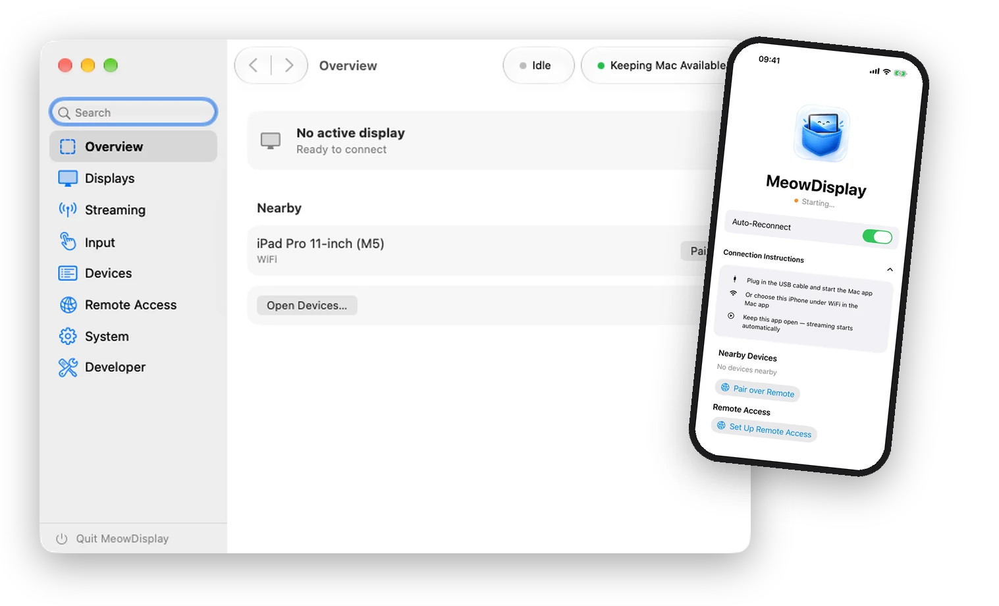
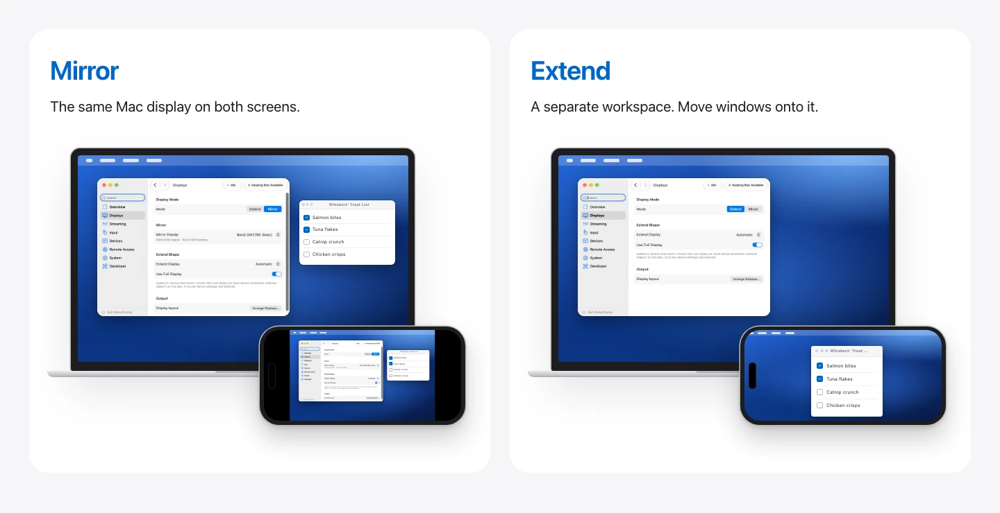
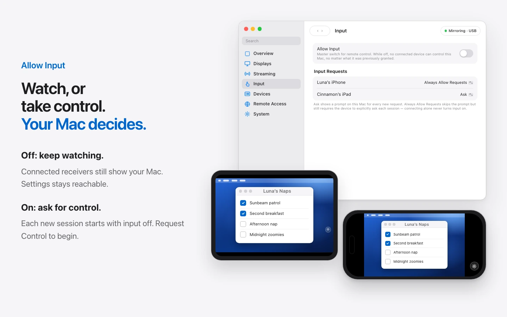
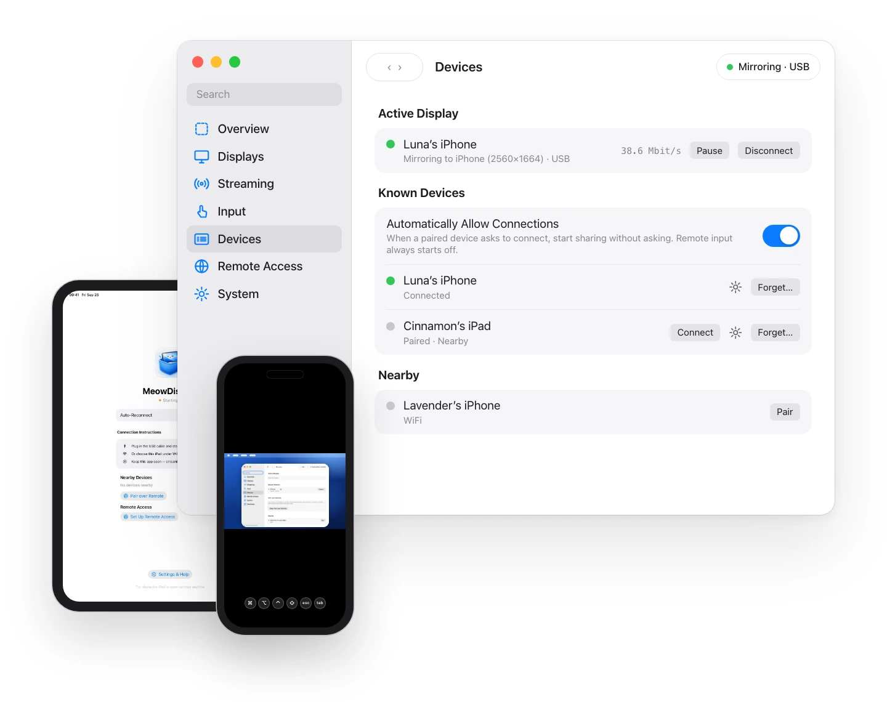

<div align="center">


# MeowDisplay

**Mac everywhere.<br>On whatever display.**

Use your iPhone or iPad as another display for your Mac — and control the Mac
right from it.

[Website](https://meowdisplay.app) ·
[Features](https://meowdisplay.app/features.html) ·
[Setup](https://meowdisplay.app/docs.html) ·
[Support](https://meowdisplay.app/support.html) ·
[Privacy](https://meowdisplay.app/privacy.html)

<br>



</div>

## Overview

MeowDisplay mirrors or extends your Mac onto an iPhone or iPad, then turns
that device into a way to work the Mac: touch, a trackpad-style pointer,
multi-finger gestures, a keyboard, and trays of modifiers and shortcuts all
travel back to the Mac. Connect over USB, local Wi-Fi, or a private network
you control, with devices paired and every session encrypted.

No MeowDisplay account is required, and there is no MeowDisplay-hosted relay
or server in the middle.

<sub>Public release builds are being prepared. There is no public download or
App Store release yet. The source is available here and can be
[built from source](#build-from-source).</sub>

## At a glance

| | |
|---|---|
| **Display** | Mirror an existing Mac display · Extend with a separate virtual workspace · clamshell and headless workflows |
| **Control** | Direct Touch · Trackpad · Precise Control in both modes · Smart Touch (Experimental) · keyboard · Apple Pencil · Mac gestures |
| **Devices & permissions** | Active Display · Known Devices · Nearby pairing · connection policies · Allow Input and per-session control requests |
| **Picture in Picture** | Keep a view-only window of the live Mac on screen while you use other apps (iPhone and iPad) |
| **Shortcuts** | Main Control Tray · Function Tray · Chords and modifier palettes · customizable actions · profiles · Auto-hide |
| **Connections** | USB · local Wi-Fi · Remote Access · Auto-Reconnect · Wake & Connect |
| **Audio** | Mac system audio on the receiver · Mac keeps playing locally · A/V sync and Resync |
| **Security** | Trusted pairing with a matching code · TLS 1.3 · pinned peer identity |
| **Receivers** | iPhone and iPad · another Mac with the display-only Mac Receiver |

## Why MeowDisplay?

MeowDisplay isn't trying to be the most powerful remote desktop. It's trying
to make one common moment take as little thought as possible: you pull out
your iPhone or iPad, your Mac is there, and you can use it.

That shapes where the effort goes:

- **Interaction feel.** Touch, pointer and gesture handling are designed for
  fingers on glass, not a mouse emulated on a phone.
- **Mirror and a real Extend.** Show a Mac display as it is, or give the Mac
  a separate virtual workspace, with clamshell and headless workflows.
- **iPhone first.** The iPhone is the main receiver, with iPad fully
  supported.
- **Your own devices and networks.** USB, local Wi-Fi, or a private network
  you control. No MeowDisplay account and no MeowDisplay-hosted relay.
- **Quick access, not administration.** It's for using your own Mac from a
  nearby screen, not for managing fleets of machines.

Many good tools cover neighboring ground — Sidecar, Luna, Astropad,
RustDesk, AnyDesk and others — each with different strengths. MeowDisplay is
simply focused on this one experience.

## Display: Mirror & Extend

<p align="center">

</p>

- **Mirror** shows an existing Mac display on the receiver. With multiple
  physical displays connected, choose which one to share. Mirror needs an
  active display to copy.
- **Extend** creates a separate software virtual display. Move windows onto
  it and arrange it alongside your other displays in macOS. Where supported,
  Extend shape controls include **Use Full Display**.

Choose the mode on the Mac, or request a switch from the receiver's Settings;
the Mac confirms the change. Extend also supports clamshell and headless
workflows without a dummy display adapter. Keep a closed MacBook connected
to power; headless compatibility is still being tested across Mac models.

## Input & gestures

Remote control requires **Allow Input** on the Mac, Accessibility permission,
and permission for the current session. Pausing the stream also pauses input.
Choose an input mode in the receiver's Settings:

- **Direct Touch** — a touch maps to the matching position on the Mac screen.
- **Trackpad** — the pointer moves relatively, like a MacBook trackpad.
  Touching doesn't jump the cursor to that spot. **Trackpad Sensitivity** is
  adjustable, and multi-finger gestures keep working.

### Allow Input & control requests

<p align="center">

</p>

**Allow Input is the Mac-wide master switch.** Receivers can stay connected
and view the Mac while it is off. Every new logical session starts with
input off; connecting never grants control.

Use **Request Control** in the receiver's Settings. The device's **Input
Requests** policy on the Mac decides what happens:

- **Ask** prompts on the Mac.
- **Always Allow Requests** skips the prompt, but the receiver still has to
  ask each session. It never bypasses Allow Input.
- **Never Allow Requests** rejects requests.

Until effective input is allowed, the receiver's control tray is unavailable;
the **Settings gear stays reachable**. The Mac can **Revoke Control** in the
device's settings, or the receiver can **Turn Off** control. These permissions
are separate from permission to connect.

A touch that input doesn't allow shows a brief **Request Input** prompt; it
never changes a setting on its own. Requests are only sent automatically when
you turn on **Request Input Automatically** for that Mac, and the Mac still
decides.

**Local view navigation is separate from input.** With **Allow Local View
Navigation** on (the default), you can pan, zoom, rotate and reset the view
on the receiver even while input is off — nothing is sent to the Mac. On
iPad, **Move View** lets one finger pan and a pinch zoom without touching the
Mac at all.

### Precise Control

**Precise Control works in Direct Touch and Trackpad.** Keep one finger down
and use another to fine-tune and click at the pointer. There's nothing to
turn on.

- **In Direct Touch**, the first touch places the pointer at that position.
  Keep it down for a moment, then add another finger: movement becomes
  relative for the rest of that touch sequence. Move either finger to
  fine-tune; the pointer never snaps back under it. Lift every finger and
  the next Direct Touch starts normally again.
- **In Trackpad**, movement is already relative from the first touch. Rest
  one finger, then use another to click or drag at the existing pointer
  location. There is no absolute-to-relative transition, and **Trackpad
  Sensitivity** still scales pointer movement.
- **In either mode**, tap the added finger to click, double- or triple-tap
  for multiple clicks, or tap, then hold and move, to drag. With one finger
  resting, tap two more fingers together to right-click.

See [Precise Control](https://meowdisplay.app/features.html#precise-control)
for the full gesture details.

### Smart Touch

**Smart Touch (Experimental)** is an optional addition to Direct Touch, on
by default and easy to turn off in the receiver's Settings. It uses the Mac's Accessibility information to recognize supported
scrollable areas and window title bars:

- Swipe a scrollable area with one finger, with momentum in either axis.
- Hold a standard window's title bar or empty toolbar space, then drag to
  move the window after the confirming haptic.
- Hold still before moving in a scrollable area to use ordinary Direct Touch
  instead. **Smart Touch Haptics** controls the hold feedback.

It works best with standard macOS accessibility information and falls back
to Direct Touch when it cannot identify the target. It has no effect in
Trackpad mode. Reliability and stability are still being improved; it does
not understand every interface. More on
[Smart Touch](https://meowdisplay.app/features.html#smart-touch).

### Pointer & viewport gestures

| Gesture | On your Mac |
|---|---|
| Tap | Click |
| Double tap | Double-click |
| Triple tap | Triple-click |
| Tap, then hold and move | Left drag |
| Two-finger tap | Right-click |
| Two-finger tap, then hold and move | Right-button drag |
| Two-finger pan | Scroll, with momentum |
| Pinch / spread | **Viewport**, **App**, or **Disabled** |
| Two-finger rotate | **Viewport**, **App**, or **Disabled**, with optional **Snap Rotation** |
| Two-finger double tap | Reset or restore the viewport zoom and pan |

### Mac system gestures

| Gesture | On your Mac |
|---|---|
| Three-finger swipe up | Mission Control |
| Three-finger swipe down | App Exposé |
| Three-finger swipe left / right | Next / Previous Space |
| Three-finger tap | Spotlight |
| Four- or five-finger spread | Show Desktop |
| Four- or five-finger pinch | Launchpad |

Full details are on the [Features page](https://meowdisplay.app/features.html#pointer).

### Apple Pencil

Use Apple Pencil for precise input on supported iPad models:

- Pencil strokes reach the Mac as pen-tablet events, separate from finger input
- Tilt is passed through with each stroke
- Hover moves the pointer before the tip touches, on iPads that support Pencil hover
- Strokes are sent at the iPad's full touch sample rate
- Fingers resting on the screen are ignored while the Pencil tip is down
- Tap and double-tap with the tip to click and double-click

Apple Pencil support is still evolving, with additional capabilities and
refinements planned for future releases.

### Trackpad mode, without the picture

Turn **Video** off and keep using MeowDisplay for pointer and keyboard input.
The connection, trays and selected input mode stay active, so the receiver
works as a trackpad and keyboard for the Mac.

### Keyboard

Tap the tray's Keyboard button for the on-screen keyboard, or use a hardware
keyboard connected to the iPhone or iPad. Latched modifiers from the Control
Tray combine with the keys you type.

## Control Trays & Chords

### Main Control Tray

The keys a touch screen is missing, close at hand: **Command**, **Option**,
**Control**, **Shift**, **Escape**, **Tab**, **Dock**, **Keyboard** and
**Settings**. Reorder controls, show or hide each one, and keep several
setups as profiles. Haptics, a landscape tray side, and Avoid Notch let it fit
the device you're holding.

### Chords

Hold or latch a modifier and a palette of matching shortcuts appears beside
it. Combine modifiers and the palette changes with the chord — for example
**⌘** for Copy, Paste and Undo, **⌘⌥** for Force Quit and Hide Others, **⌘⇧**
for Redo and Screenshot. Pick commands without reaching for a physical
keyboard, and choose which actions each palette offers.

### Function Tray

A separate tray of one-tap actions — **Zoom In**, **Zoom Out**, **Undo** and
**Redo** by default. It's customized independently of the Main Control Tray,
with its own profiles, and can sit on the same or the opposite side.

Add, remove, reorder and rename its actions, and give each one a face — an
SF Symbol, text, an emoji, or its keys. Custom actions can be one-tap
keyboard shortcuts (including multi-key chords) or short sequences of
existing actions, and chord palettes can offer them too.

### iPad controls

On iPad, choose how the controls sit around the Mac:

- **Strip** — a solid rail on any edge, with the Mac's picture fitted beside
  it.
- **Overlay** — the Mac fills the screen and the controls float over it in
  compact trays.
- **Custom** — up to five layouts of your own, with separate landscape and
  portrait arrangements, built in a full-screen visual editor with Preview,
  alignment guides and snapping. Layouts can be shared as a code and
  imported on another iPad.

The Main and Function controls pick their edges independently, **Control
Size** scales them, and **Two-Hand Assist** puts helper modifiers on the
opposite side. While the on-screen keyboard is up, a keyboard accessory bar
with modifiers, Escape and Tab takes the controls' place. iPhone keeps the
Control Trays above.

### Auto-hide

**There when you need it. Out of the way when you don't.** With Auto-hide, the
control trays retreat after a period of inactivity and interacting with the
receiver brings them back. Manual Collapse stays separate, and Auto-hide can
be turned off.

## Devices

<p align="center">

</p>

Pair a receiver once, then manage it in **Devices** on the Mac:

- **Active Display** shows live receiver/display sessions and connection
  state, with **Pause** and **Disconnect**.
- **Known Devices** includes paired receivers that are **Connected**,
  **Paired · Nearby**, or **Paired · Offline**. When reachable, connect with
  **Mirror** or **Extend**. Open device settings or **Forget** a pairing.
- **Nearby** lists unpaired discoverable receivers ready to pair.

**Connection permissions** decide whether a paired device can start sharing.
**Automatically Allow Connections** is on by default. Each device can use
**Default** (follow that switch), **Always Allow**, or **Block**. Blocking keeps
the pairing. These choices never grant remote control.

Either side can start a session, and the Mac sender always streams. When
connection approval is required, an explicit Connect waits for acceptance;
background reconnects never prompt.

Receivers include **iPhone**, **iPad**, and the **display-only Mac Receiver**.
The Mac Receiver does not forward its keyboard or trackpad to the other Mac.
More on [Devices](https://meowdisplay.app/features.html#devices).

## Connections

- **USB** — plug in a data-capable cable and trust the Mac. A direct,
  reliable path with no network setup.
- **Local Wi-Fi** — receivers are discovered over Bonjour on your network,
  including nearby peer-to-peer Wi-Fi.
- **Remote Access** — reach a paired Mac through a private network you
  control, such as Tailscale. The address only routes the connection; pairing
  still authenticates it.
- **Network Transport** — on Wi-Fi and Remote Access, each device can use
  **Auto** (the default), **QUIC** or **TCP** (Mac Settings → the device).
  Both use the same pairing and encryption; Auto uses QUIC when both apps
  support it and uses TCP if QUIC can't get through. USB is unaffected.
- **Auto-Reconnect** restores the session whenever the connection becomes
  available again.
- **Wake & Connect** can wake a supported paired Mac on its network and
  reconnect when it becomes available. It needs Wake for Network Access and
  compatible hardware, and is designed for a logged-in Mac that has gone to
  sleep or locked. See
  [Setup](https://meowdisplay.app/docs.html) for networking limitations.

## Audio

Mac system audio can stream to the receiver while the Mac keeps playing
locally. Turn it on with the receiver's **Audio** toggle; if sound and picture
drift apart, adjust **A/V Sync** or tap **Resync**.

## Picture in Picture

On iPhone and iPad, the Mac can stay in view while you do something else.
MeowDisplay uses the system's own Picture in Picture window, fed by the same
stream the receiver is already showing.

- **Automatic or manual.** With **Picture in Picture** on (the default), a
  live session can enter the system floating window when you leave the app,
  when supported and available. Receiver Settings also offers **Start Picture
  in Picture** and **Stop Picture in Picture**.
- **For glancing, not controlling.** The window is view-only: it shows what
  your Mac is doing, but touches in it never reach the Mac. All interaction
  stays in the full receiver.
- **One tap back.** The window's restore button returns you to the full
  receiver, and opening MeowDisplay again does the same.
- **Audio.** If the receiver's **Audio** is on, Mac audio can keep playing
  while the window is showing. Leaving the app without Picture in Picture
  still silences the receiver as before.
- **Your choice.** Turn Picture in Picture off in the receiver's Settings and
  leaving the app never starts it.

Picture in Picture is new; physical-device validation is not yet complete.

## Security

- Devices pair explicitly, confirming a matching verification code (SAS) on
  both screens.
- Every session is encrypted and mutually authenticated with **TLS 1.3**
  against the **pinned peer identity** you trusted.
- There is no plaintext media fallback.

More in [SECURITY.md](SECURITY.md) and the
[Privacy page](https://meowdisplay.app/privacy.html).

## Requirements

| App | Runs on |
|---|---|
| **MeowDisplay** (the Mac app that shares its display) | macOS 14 or later |
| **MeowDisplay Receiver** (a spare Mac as a display) | macOS 12 or later |
| **MeowDisplay** for iPhone and iPad | iOS / iPadOS 16.4 or later |

Remote control of the Mac needs Accessibility permission; capturing a
display needs Screen Recording.

## Getting started

1. Run MeowDisplay on your Mac.
2. Open the MeowDisplay receiver on your iPhone or iPad.
3. Connect over USB or Wi-Fi, and pair the devices by confirming the matching
   code.
4. Choose **Mirror** or **Extend**.
5. Grant Screen Recording and Local Network permissions as requested. For
   control, also grant Accessibility, enable **Allow Input** on the Mac, and
   use **Request Control** in the receiver's Settings.

The [Setup guide](https://meowdisplay.app/docs.html) covers permissions,
pairing, USB & Wi-Fi, Remote Access and troubleshooting.

## Build from source

```sh
git clone https://github.com/raiseCatError/meowdisplay.git
cd meowdisplay
echo "DEVELOPMENT_TEAM=YOURTEAMID" > .env
./generate.sh
```

Open `MeowDisplay.xcodeproj` and run the `OpenSidecarMac` (Mac) and
`OpenSidecariOS` (iPhone/iPad receiver) schemes. Signing, permissions and
troubleshooting are in [SETUP.md](SETUP.md); release process in
[RELEASE.md](RELEASE.md).

## Documentation

- [Features](https://meowdisplay.app/features.html) ·
  [Setup](https://meowdisplay.app/docs.html) ·
  [Support](https://meowdisplay.app/support.html) ·
  [Privacy](https://meowdisplay.app/privacy.html)
- [SETUP.md](SETUP.md) — building, signing and local setup
- [SECURITY.md](SECURITY.md) — security model and reporting issues
- [PROTOCOL.md](PROTOCOL.md) and [COMPATIBILITY.md](COMPATIBILITY.md) — wire
  protocol and versioning
- [ARCHITECTURE.md](ARCHITECTURE.md) — how the apps fit together and where
  to start in the code
- [TECHNICAL_NOTES.md](TECHNICAL_NOTES.md) — virtual displays, sleep and
  wake, and other internals

## Contributing

Source, issues and releases live at
[github.com/raiseCatError/meowdisplay](https://github.com/raiseCatError/meowdisplay).
Issues and pull requests are welcome, especially testing on iPad, different
Mac models, external-display setups and networks. Please open an issue before
starting large architecture work.

See [CONTRIBUTING.md](CONTRIBUTING.md) and the
[Code of Conduct](CODE_OF_CONDUCT.md). Report security vulnerabilities
privately as described in [SECURITY.md](SECURITY.md), never in a public issue.

**Want to translate MeowDisplay?** Community translations are welcome.
Human-written translations only, please — no AI or machine-generated
localization. See [Translations in CONTRIBUTING.md](CONTRIBUTING.md#translations)
for how to get started.

## Built on OpenDisplay

MeowDisplay started as a fork of
[OpenDisplay](https://github.com/peetzweg/opendisplay) by Philip Poloczek.
OpenDisplay already had a working low-level foundation — Mac screen
capture, virtual displays, video encoding and an iPhone/iPad receiver — and
there was no good reason to rebuild a working open-source base just to say
every layer was written from scratch. Thank you to OpenDisplay for it.

Most of MeowDisplay's own work since then has gone into what happens on top
of that foundation: Direct Touch, Trackpad and gestures, Smart Touch,
Precise Control, the control trays, Remote Access, pairing and security,
the session lifecycle, clamshell and headless use, audio, Picture in Picture,
and a lot of polish.

If you only need the core second-display experience, or compatibility that
the upstream project serves better, OpenDisplay is well worth a look.

## Responsible use

MeowDisplay is intended for devices you own or are authorized to use. Don't
use it to watch, access or control someone else's device without their
permission.

## License & credits

MeowDisplay is licensed under [GPL-3.0](LICENSE). It began as a fork of
[OpenDisplay](https://github.com/peetzweg/opendisplay) by Philip Poloczek,
which provided the original display, capture, encoding and receiver
foundation. Original work Copyright (c) 2026 Philip Poloczek; this fork's
changes are contributed under the same license. If you distribute a modified
version, it must remain open source under the same license with attribution
intact.

Independent open-source software, not affiliated with Apple.

<div align="center">

<sub>Made by raiseCatError</sub>

</div>
